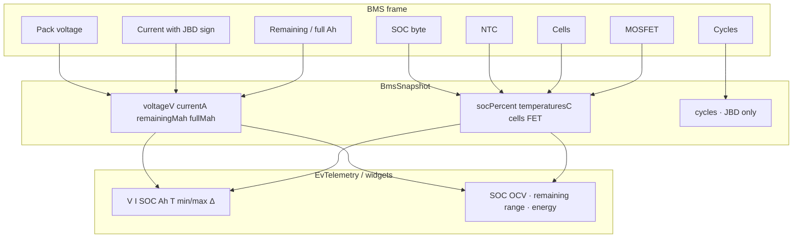
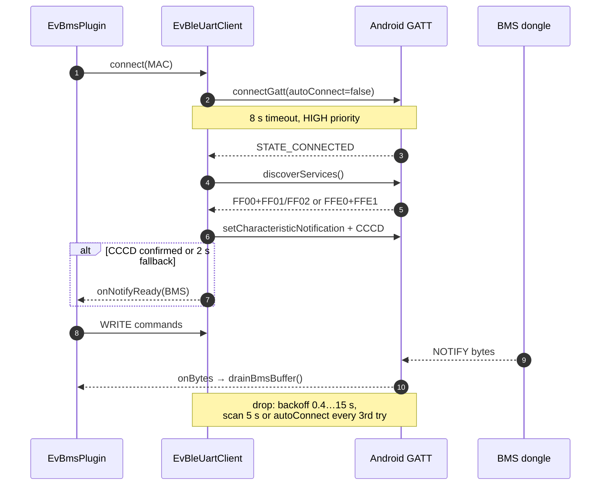
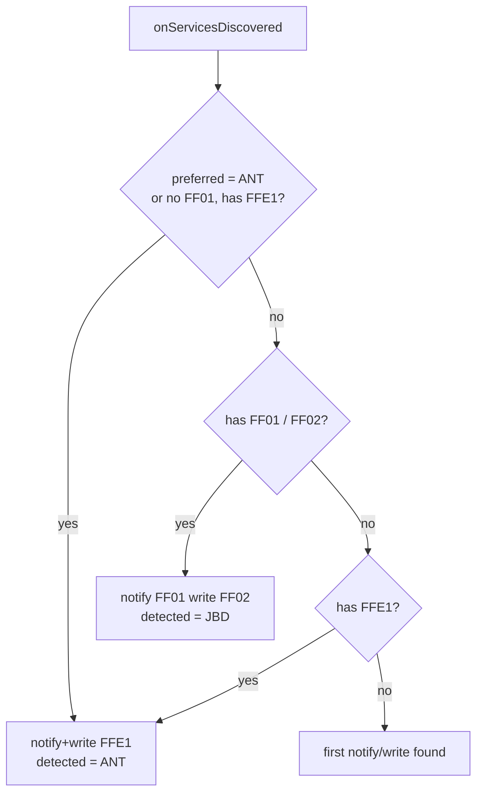
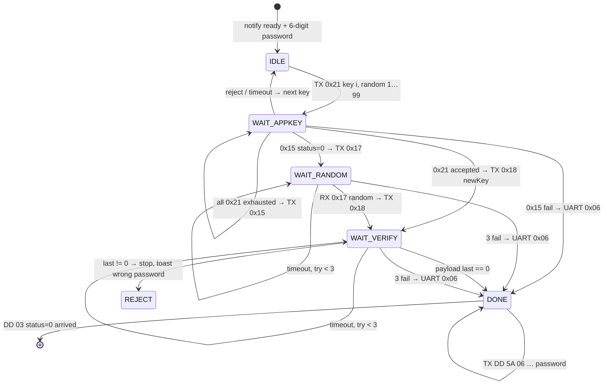
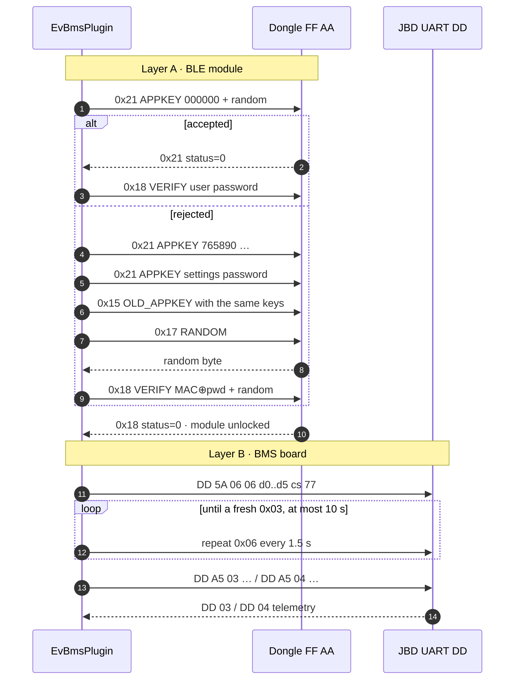
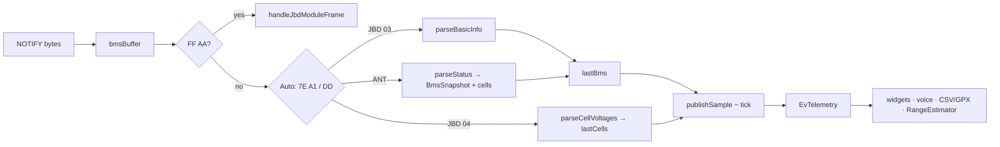

# BMS: telemetry fields, poll rates, and the BLE link

This document describes **what EV-Telemetry actually reads** from **JBD / Xiaoxiang** and **ANT BMS** over Bluetooth LE, how often it arrives, and how authorization and the GATT session work.

Source: `OsmAnd/src/net/osmand/plus/plugins/evbms/`  
(`JbdBmsProtocol`, `JbdBleModuleProtocol`, `AntBmsProtocol`, `EvBleUartClient`, `EvBmsPlugin`).

The motor controller (FarDriver / VESC) and the CSC wheel sensor are not covered here. See [`EV-Telemetry.md`](EV-Telemetry.md) for the full field list.

---

## 1. Two protocols on one UART

After GATT, both BMS devices look like a byte stream: the plugin writes a command to the WRITE characteristic and waits for NOTIFY. The frames differ after that.

| | **JBD / Xiaoxiang** | **ANT BMS** |
|---|---|---|
| Advertised names | `xiaoxiang`, `jbd`, `SP…`, `overkill`, `smart bms` | `ANTBMS`, `ANT-BMS`, `ant_bms`, `ant-…` |
| GATT service | `0000ff00-…` | `0000ffe0-…` (same as FarDriver) |
| Notify | `0000ff01` | `0000ffe1` (same UUID as write) |
| Write | `0000ff02` | `0000ffe1` |
| Frame | `DD … 77` | `7E A1 … AA 55` |
| Auth | yes: BLE dongle **and** UART BMS | none (the plugin never sends a password) |
| Cells | separate register `0x04`, alternated with the pack | same status frame |


Protocol in settings: **Auto / JBD / ANT**. Auto looks at the service UUID, the name, and the first byte of the buffer (`0xDD` vs `0x7E 0xA1`). `FF AA` frames are always parsed as Xiaoxiang BLE-module replies, even when JBD UART follows.

---

## 2. Poll rate

The plugin is **request–response**, not a push stream. `pollRunnable` ticks at `min(BMS_poll, CTRL_poll)` and sends a BMS command when `BMS_POLL_MS` has elapsed.

| Parameter | Value |
|---|---|
| Allowed BMS intervals | **200 / 500 / 1000 / 2000 / 5000 / 10000 ms** |
| Default BMS | **500 ms (2 Hz)** |
| Safe maximum | **200 ms (5 Hz)** — faster and frames overlap |
| Hike mode | no faster than **5 s** |
| Data is fresh | `max(5 s, 3 × poll)` |
| Link is dead | `max(12 s, 4 × poll)` |
| Remaining range | samples **once per second**, independent of BLE |
| CSV / GPX | **1 s** default; unchanged rows are not written |

### What actually updates on one poll

**ANT:** one `statusRequest()` → one `0x11` frame with **everything**: pack, current, SOC, Ah, MOSFETs, **all cells and temperatures**. Full snapshot = poll rate.

**JBD:** one poll = **either** register `0x03` (pack) **or** `0x04` (cells). The plugin alternates (`pollCellsNext`). A full cell snapshot = **two polls**.

| BMS interval | Requests/s | ANT full snapshot | JBD pack `0x03` | JBD cells `0x04` |
|---|---:|---:|---:|---:|
| 200 ms | 5 | 5 Hz | 2.5 Hz | 2.5 Hz |
| **500 ms (default)** | **2** | **2 Hz** | **1 Hz** | **1 Hz** |
| 1 s | 1 | 1 Hz | 0.5 Hz | 0.5 Hz |
| 2 s | 0.5 | 0.5 Hz | 0.25 Hz | 0.25 Hz |
| 5 s | 0.2 | 0.2 Hz | 0.1 Hz | 0.1 Hz |
| 10 s | 0.1 | 0.1 Hz | 0.05 Hz | 0.05 Hz |

```mermaid
gantt
    title One ANT cycle at poll = 500 ms
    dateFormat X
    axisFormat %L ms
    section Request
    7E A1 01 status      :c1, 0, 500
    7E A1 01 status      :c2, 500, 500
    7E A1 01 status      :c3, 1000, 500
    7E A1 01 status      :c4, 1500, 500
    section Snapshot
    Pack plus all cells  :d1, 0, 500
    Pack plus all cells  :d2, 500, 500
    Pack plus all cells  :d3, 1000, 500
    Pack plus all cells  :d4, 1500, 500
```




While Xiaoxiang unlock is running (`advanceJbdAuth() == true`), **JBD telemetry is not requested** — poll slots go to `FF AA`. ANT has no such phase.

---

## 3. Fields the plugin gets from the BMS

Below is what the parser puts into `BmsSnapshot` and then `EvTelemetry`.  
“On the wire, not used” is listed separately.

### 3.1. Application field summary

| `EvTelemetry` field | Unit | JBD | ANT | How it is computed | Typical rate |
|---|---|:---:|:---:|---|---|
| `voltageV` | V | yes | yes | pack / 1000 (JBD) or ×0.01 (ANT) | poll / 2 (JBD) · poll (ANT) |
| `currentA` | A | yes | yes | **+ charge into pack, − discharge** (JBD signed ×10 mA; ANT signed ×0.1 A) | same |
| `socPercent` | % | yes | yes | JBD: SOC byte; ANT: u16 0…100. Widget: coulomb `remaining/full`, else this value | same |
| `remainingAh` | Ah | yes | yes | JBD: mAh×10 / 1000; ANT: u32 × 10⁻⁶ Ah | same |
| `fullAh` | Ah | yes | yes | same | same |
| `cycles` | count | yes | **no** | JBD u16; ANT snapshot always `0` | poll / 2 |
| `bmsTempC` | °C | yes | yes | live NTC (widget/voice) | poll / 2 · poll |
| NTC list | °C | yes | yes | JBD: `(raw−2731)/10`; ANT: signed °C, −40…120 | same |
| `cellCount` | count | yes | yes | JBD byte; ANT byte, 1…32 | same |
| cells `cells[]` | V | yes | yes | u16 mV; JBD BE, ANT LE | **poll / 2** · **poll** |
| `minCellVoltageV` | V | yes | yes | `min(cells)` | after a cell frame |
| `maxCellVoltageV` | V | yes | yes | `max(cells)` | same |
| `cellImbalanceV` | V | yes | yes | max − min if ≥ 2 cells | same |
| Charge MOSFET | bool | yes | yes | JBD FET bit0; ANT byte `== 0x01` | pack / status |
| Discharge MOSFET | bool | yes | yes | JBD FET bit1; ANT byte `== 0x01` | same |
| `socVoltagePercent` | % | derived | derived | `SocCalibrator` from min cell (OCV / I·R), not the BMS byte | ~1 s |
| Remaining range, Wh, DOC | — | derived | derived | `RangeEstimator`, current from **BMS only** | 1 s |

Controller current sign **does not** enter the energy integral.

### 3.2. JBD UART V4 — register `0x03` (basic info)

Request:

```
DD A5 03 00 FF FD 77
```

Reply: `DD 03 <status> <len> <payload> <cs:2> 77`.  
`status == 0` — ok, `0x80` — denied, `0x83` — password required.

| Payload offset | Type | Scale | Plugin | Field |
|---|---|---|:---:|---|
| 0…1 | u16 BE | ×10 mV | yes | pack voltage |
| 2…3 | s16 BE | ×10 mA | yes | current (+ charge / − discharge) |
| 4…5 | u16 BE | ×10 mAh | yes | remaining |
| 6…7 | u16 BE | ×10 mAh | yes | full capacity |
| 8…9 | u16 BE | 1 | yes | cycles |
| 10…11 | u16 | date | **no** | manufacture date |
| 12…15 | u32 | bits | **no** | balance flags |
| 16…17 | u16 | bits | **no** | protection (OV/UV/OT/UT/OC…) |
| 18 | u8 |  | **no** | firmware version |
| 19 | u8 | % | yes | BMS SOC |
| 20 | u8 | bits | yes | FET: bit0 charge, bit1 discharge |
| 21 | u8 |  | yes | cell count |
| 22 | u8 |  | yes | NTC count |
| 23+ | u16 BE × N | `(raw − 2731) / 10` °C | yes | temperatures |

Minimum payload length the parser accepts: **23 bytes**.

### 3.3. JBD UART V4 — register `0x04` (cells)

Request:

```
DD A5 04 00 FF FC 77
```

Each cell is u16 BE in **millivolts** → volts `/ 1000`. Cell count = `len / 2`. The full array is stored in `lastCells`; CSV/widgets get min, max, and imbalance, not every cell separately.

### 3.4. ANT — status frame `0x11`

Request (CRC16-MODBUS little-endian on the fly):

```
7E A1 01 00 00 BE <crc_lo> <crc_hi> AA 55
```

Reply: `7E A1 11 … <crc16> AA 55`.

| Frame offset | Type | Scale | Plugin | Field |
|---|---|---|:---:|---|
| 8 | u8 |  | yes | temperature sensor count (≤ 8) |
| 9 | u8 |  | yes | cell count (1…32) |
| 34 + n×2 | u16 LE | mV | yes | cell n |
| then × tempSensors | s16 LE | °C | yes | NTC, only −40…120 |
| +2 and +4 after NTCs | s16 LE | °C | yes | two more sensors (often MOSFET / balance) |
| 38 + offset | u16 LE | ×0.01 V | yes | pack voltage |
| 40 + offset | s16 LE | ×0.1 A | yes | current |
| 42 + offset | u16 LE | % | yes | SOC |
| 46 + offset | u8 | `0x01` = on | yes | charge MOSFET |
| 47 + offset | u8 | `0x01` = on | yes | discharge MOSFET |
| 50 + offset | u32 LE | ×10⁻⁶ Ah | yes | full capacity |
| 54 + offset | u32 LE | ×10⁻⁶ Ah | yes | remaining |
| cycles | — | — | **no** | `BmsSnapshot.cycles = 0` |

`offset = 2×cellCount + 2×tempSensors`. A frame without CRC, or with a cell count outside 1…32, is dropped.

### 3.5. On the wire, not in the UI

| Source | Data | Why unused |
|---|---|---|
| JBD `0x03` | date, balance bits, protection, version | widgets and remaining range do not use them |
| JBD | settings registers, EEPROM, serial | no requests except `0x03` / `0x04` / `0x06` |
| ANT | cycles, serial, functions other than `0x11` | only status is parsed |
| Both | per-cell charts | telemetry gets min / max / Δ |



---

## 4. BLE connection

Class: `ble/EvBleUartClient`, role `BMS`. Separate GATT from the controller and CSC.

### 4.1. Device picker

1. The user scans BLE (low latency). JBD/ANT names and services `FF00` / `FFE0` appear in the list.
2. **MAC** (`BMS_ADDRESS`) and optionally the protocol are stored.
3. On plugin start: `connect(activity, mac)` if the address is not empty.

### 4.2. GATT session



| Step | Detail in code |
|---|---|
| Link priority | `CONNECTION_PRIORITY_HIGH` right after CONNECT |
| MTU | **not requested** — frames are short, 20–23 ATT bytes is enough |
| Write type | `WRITE_NO_RESPONSE` if the characteristic supports it, else default |
| Notify ready | CCCD write callback **or** 2 s fallback (modules that never confirm) |
| First connection | `connectGatt(autoConnect=false)`, timeout **8 s** |
| Retry | 5 s scan by MAC, or `autoConnect=true` on attempts 2, 5, 8…, timeout **25 s** |
| Backoff | 400 ms → … → 15 s |
| Live GATT | **not torn down** if UART is silent: unlock and poll continue |
| Watchdog | no notify after connect → `forceReconnect("no-notify")` |

Choosing the BMS characteristic:



ANT often sits on the same `FFE0` as FarDriver. Client role (`BMS` vs `CONTROLLER`) splits two GATTs: BMS then uses `FFE1`, the controller uses `FFEC`.

---

## 5. JBD / Xiaoxiang authorization

Two locks in a row. ANT is not in this path: after CCCD it immediately sends `statusRequest()`.

| Layer | Frames | Why |
|---|---|---|
| **A. BLE module** | `FF AA <cmd> <len> <payload> <sum>` | Xiaoxiang dongle blocks UART until an appkey / password is accepted |
| **B. UART BMS** | `DD 5A 06 06 <6 digits 0–9> <cs> 77` | register `0x06` USE PASSWORD on the JBD board itself |

Password in settings: **exactly 6 digits**. Otherwise layer B is not sent; layer A does not start either (`advanceJbdAuth` is immediately `false`).

### 5.1. BLE-module frames (`JbdBleModuleProtocol`)

Format: `FF AA`, checksum `cmd + len + payload` mod 256.

| cmd | Name | Purpose |
|---|---|---|
| `0x21` | APPKEY_VERIFY | new appkey: `(MAC[i] XOR key[i]) + random`, plus a random byte |
| `0x15` | OLD_APPKEY | old: 6 ASCII key digits |
| `0x17` | RANDOM | nonce request |
| `0x18` / `0x1B` | VERIFY | `(MAC[i] XOR pwd[i]) + random` without a trailing random byte |
| `0x19` | BROADCAST | assembled in the plugin, unused in the unlock loop |

Appkey order: **`000000`**, **`765890`**, then the 6-digit settings password if it is different.

Timeouts: appkey/verify **1.5 s**, random **1.2 s**, at most **3** random/verify tries, then UART `0x06`.

Accepted: last payload byte **`0`**.

### 5.2. State machine





Verify formula (both appkey variants):

```
coded[i] = (MAC[i] XOR password[i]) + random     // i = 0…5, MAC from 6 GATT octets
payload  = coded            // cmd 0x18 / 0x1B
payload  = coded + random   // cmd 0x21, newAppKey
```

UART `0x06` digits are encoded **as numbers 0…9**, not ASCII (`'1'` → byte `0x01`).

### 5.3. UART errors

| `status` in `DD <reg> <status>` | Code | Behaviour |
|---|---|---|
| `0x00` | OK | `0x03`/`0x04` frame is parsed |
| `0x80` | DENIED | toast “password required” if settings are empty |
| `0x83` | PASSWORD | toast “wrong password”, `jbdPasswordRejected = true`, unlock stops |

UART password retry: immediately after DONE, then at most once per **1.5 s**, and only again if **10 s** passed without a fresh `0x03`.

Changing the password in settings resets the machine (`resetJbdAuth`) and starts unlock again if the BMS is already connected.

---

## 6. From byte to widget



`publishSample()` runs on **every tick** (`min` of BMS and controller intervals), even if no new BMS frame arrived: widgets keep the last fresh value until `dataStaleMs` expires.

Remaining range takes `currentA` **only if the BMS is fresh** — otherwise that energy step has no current.

---

## 7. Practical consequences

| Topic | Takeaway |
|---|---|
| Remaining range and energy | need **live JBD/ANT current**; controller current is not substituted |
| Min cell / imbalance | on JBD this updates **half as often** as the pack at the same poll |
| 5 Hz BMS | useful for current/power on the chart; JBD cells stay at 2.5 Hz; keep CSV at 1 s |
| ANT vs JBD | ANT sends cells every frame — imbalance is fresher at the same poll |
| JBD password | without 6 digits Xiaoxiang often gives GATT but empty UART; not the Android PIN |
| ANT | no password in the plugin; if the module is locked in firmware, connecting will not help |
| Two BLE links | BMS and controller are **two** `BluetoothGatt`s; do not hang both on one MAC |

---

## 8. Files in the repository

| File | Role |
|---|---|
| `protocol/JbdBmsProtocol.kt` | `DD` frames, `0x03` / `0x04` / `0x06` |
| `protocol/JbdBleModuleProtocol.kt` | `FF AA` frames, appkey / random / verify |
| `protocol/AntBmsProtocol.kt` | `7E A1` status `0x11` |
| `protocol/BmsSnapshot.kt` | shared snapshot |
| `ble/EvBleUartClient.kt` | GATT, UUIDs, reconnect |
| `EvBmsPlugin.kt` | poll, unlock, `drainBmsBuffer`, `publishSample` |
| `EvTelemetry.kt` / `TelemetryField.kt` | UI / CSV fields |

This description matches the code on `feature/ev-bms-fardriver-plugin`.
