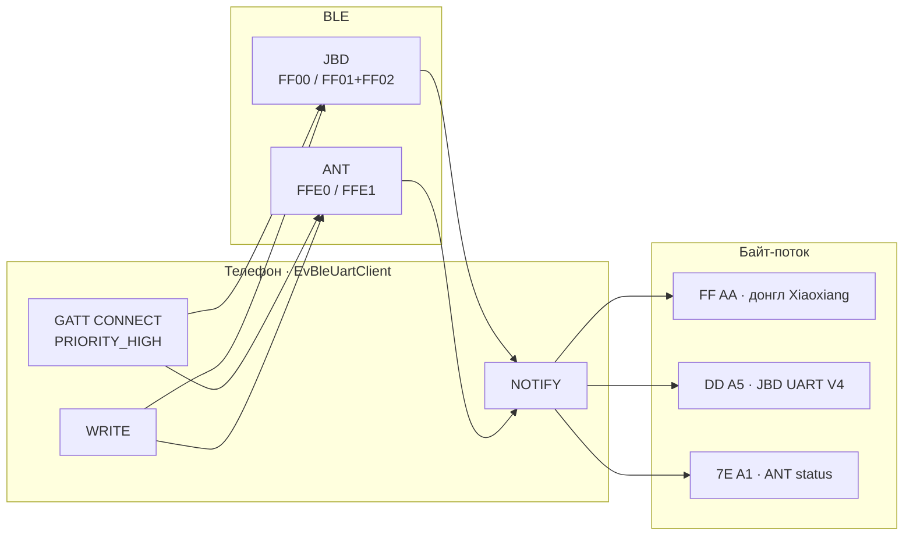
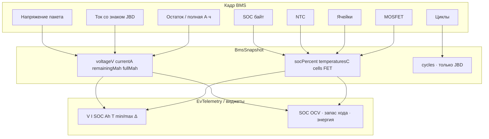
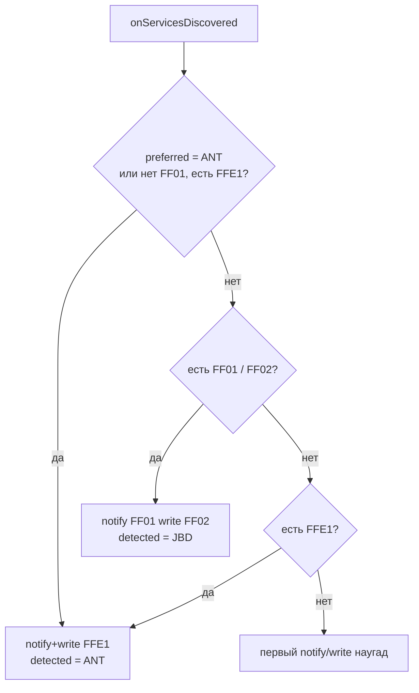
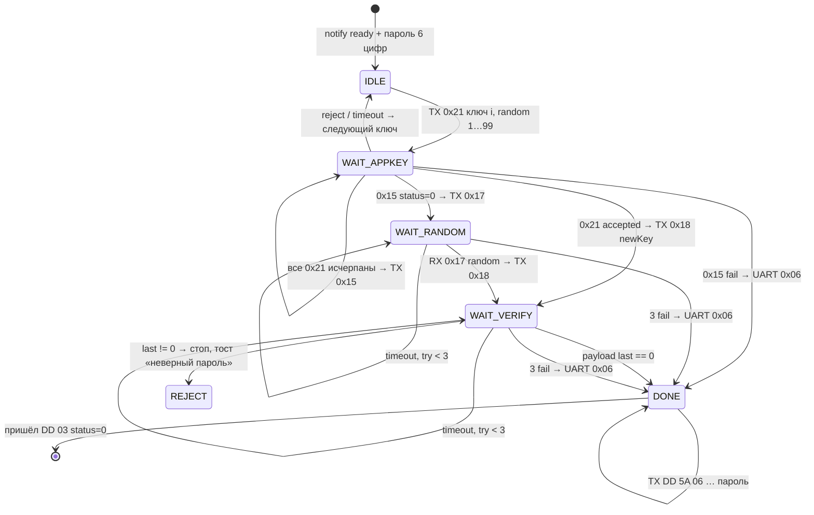
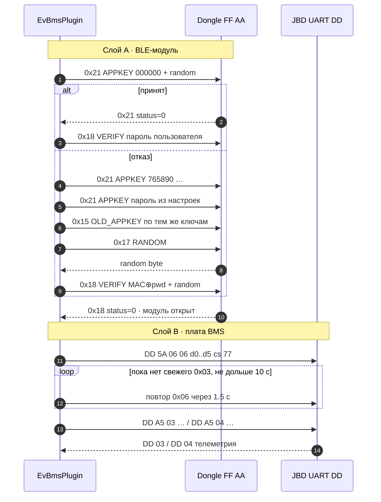
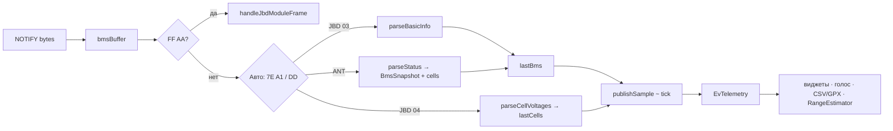

# BMS: поля телеметрии, частоты и соединение

Документ описывает, **что плагин EV-Telemetry реально читает** с **JBD / Xiaoxiang** и **ANT BMS** по Bluetooth LE, с какой частотой это приходит в приложение и как устроены авторизация и GATT-сессия.

Источник: `OsmAnd/src/net/osmand/plus/plugins/evbms/`  
(ветки `JbdBmsProtocol`, `JbdBleModuleProtocol`, `AntBmsProtocol`, `EvBleUartClient`, `EvBmsPlugin`).

Контроллер мотора (FarDriver / VESC) и датчик колеса CSC в этот файл не входят.

---

## 1. Два разных мира на одном UART

После GATT оба BMS выглядят как «байт-поток»: плагин пишет команду в characteristic WRITE и ждёт NOTIFY. Дальше кадры разные.

| | **JBD / Xiaoxiang** | **ANT BMS** |
|---|---|---|
| Имена в эфире | `xiaoxiang`, `jbd`, `SP…`, `overkill`, `smart bms` | `ANTBMS`, `ANT-BMS`, `ant_bms`, `ant-…` |
| GATT-сервис | `0000ff00-…` | `0000ffe0-…` (как FarDriver) |
| Notify | `0000ff01` | `0000ffe1` (тот же UUID, что и запись) |
| Write | `0000ff02` | `0000ffe1` |
| Кадр | `DD … 77` | `7E A1 … AA 55` |
| Авторизация | да: BLE-донгл **и** UART BMS | нет (в плагине пароль не шлётся) |
| Ячейки | отдельный регистр `0x04`, чередуется с пакетом | в том же статус-кадре |



Протокол в настройках: **Авто / JBD / ANT**. Авто смотрит UUID сервиса, имя и первый байт буфера (`0xDD` vs `0x7E 0xA1`). Кадры `FF AA` всегда разбираются как ответы BLE-модуля Xiaoxiang, даже если дальше пойдёт JBD UART.

---

## 2. Частота опроса

Плагин — **запрос–ответ**, не поток. Таймер `pollRunnable` тикает с `min(BMS_poll, CTRL_poll)` и шлёт BMS-команду, если прошло `BMS_POLL_MS`.

| Параметр | Значение |
|---|---|
| Допустимые интервалы BMS | **200 / 500 / 1000 / 2000 / 5000 / 10000 мс** |
| По умолчанию BMS | **500 мс (2 Гц)** |
| Безопасный максимум | **200 мс (5 Гц)** — быстрее кадры накладываются |
| Режим «Поход» | не чаще **5 с** |
| Данные «свежие» | `max(5 с, 3 × poll)` |
| Связь «мертва» | `max(12 с, 4 × poll)` |
| Запас хода | пробы **раз в 1 с**, независимо от BLE |
| CSV / GPX | по умолчанию **1 с**; неизменённые строки не пишутся |

### Что реально обновляется за один poll

**ANT:** один запрос `statusRequest()` → один кадр `0x11` со **всем**: пакет, ток, SOC, А·ч, MOSFET, **все ячейки и температуры**. Полный снимок = частота опроса.

**JBD:** один poll = **либо** регистр `0x03` (пакет), **либо** `0x04` (ячейки). Плагин чередует их (`pollCellsNext`). Полный снимок ячеек = **два опроса**.

| Интервал BMS | Запросов/с | ANT: полный снимок | JBD: пакет `0x03` | JBD: ячейки `0x04` |
|---|---:|---:|---:|---:|
| 200 мс | 5 | 5 Гц | 2.5 Гц | 2.5 Гц |
| **500 мс (default)** | **2** | **2 Гц** | **1 Гц** | **1 Гц** |
| 1 с | 1 | 1 Гц | 0.5 Гц | 0.5 Гц |
| 2 с | 0.5 | 0.5 Гц | 0.25 Гц | 0.25 Гц |
| 5 с | 0.2 | 0.2 Гц | 0.1 Гц | 0.1 Гц |
| 10 с | 0.1 | 0.1 Гц | 0.05 Гц | 0.05 Гц |

```mermaid
gantt
    title Один цикл JBD при poll = 500 мс
    dateFormat X
    axisFormat %L мс
    section Запрос
    0x03 пакет           :a1, 0, 500
    0x04 ячейки          :a2, 500, 500
    0x03 пакет           :a3, 1000, 500
    0x04 ячейки          :a4, 1500, 500
    section Снимок
    Пакет V/I/Ah/SOC     :b1, 0, 500
    Ячейки min/max       :b2, 500, 500
    Пакет V/I/Ah/SOC     :b3, 1000, 500
    Ячейки min/max       :b4, 1500, 500
```

```mermaid
gantt
    title Один цикл ANT при poll = 500 мс
    dateFormat X
    axisFormat %L мс
    section Запрос
    7E A1 01 status      :c1, 0, 500
    7E A1 01 status      :c2, 500, 500
    7E A1 01 status      :c3, 1000, 500
    7E A1 01 status      :c4, 1500, 500
    section Снимок
    Пакет + все ячейки   :d1, 0, 500
    Пакет + все ячейки   :d2, 500, 500
    Пакет + все ячейки   :d3, 1000, 500
    Пакет + все ячейки   :d4, 1500, 500
```





Пока идёт unlock Xiaoxiang (`advanceJbdAuth() == true`), **телеметрию JBD не запрашивают** — слоты poll уходят на `FF AA`. ANT этой фазы не имеет.

---

## 3. Поля, которые плагин получает с BMS

Ниже — то, что парсер кладёт в `BmsSnapshot` и дальше в `EvTelemetry`.  
«На проводе есть, плагин не читает» — отдельные строки.

### 3.1. Сводка по полям приложения

| Поле `EvTelemetry` | Ед. | JBD | ANT | Как считается | Типичная частота |
|---|---|:---:|:---:|---|---|
| `voltageV` | В | да | да | пакет / 1000 (JBD) или ×0.01 (ANT) | poll / 2 (JBD) · poll (ANT) |
| `currentA` | А | да | да | **+ заряд в пакет, − разряд** (JBD signed ×10 мА; ANT signed ×0.1 А) | то же |
| `socPercent` | % | да | да | JBD: байт SOC; ANT: u16 0…100. Виджет: кулоны `remaining/full`, иначе это значение | то же |
| `remainingAh` | А·ч | да | да | JBD: mAh×10 / 1000; ANT: u32 × 10⁻⁶ А·ч | то же |
| `fullAh` | А·ч | да | да | то же | то же |
| `cycles` | шт. | да | **нет** | JBD u16; ANT в снимке всегда `0` | poll / 2 |
| `bmsTempC` | °C | да | да | мин. живой NTC (виджет/голос) | poll / 2 · poll |
| список NTC | °C | да | да | JBD: `(raw−2731)/10`; ANT: signed °C, −40…120 | то же |
| `cellCount` | шт. | да | да | JBD байт; ANT байт, 1…32 | то же |
| ячейки `cells[]` | В | да | да | u16 мВ; JBD BE, ANT LE | **poll / 2** · **poll** |
| `minCellVoltageV` | В | да | да | `min(cells)` | после кадра ячеек |
| `maxCellVoltageV` | В | да | да | `max(cells)` | то же |
| `cellImbalanceV` | В | да | да | max − min, если ≥ 2 ячеек | то же |
| MOSFET заряд | bool | да | да | JBD FET bit0; ANT байт `== 0x01` | пакет / статус |
| MOSFET разряд | bool | да | да | JBD FET bit1; ANT байт `== 0x01` | то же |
| `socVoltagePercent` | % | произв. | произв. | `SocCalibrator` по мин. ячейке (OCV / I·R), не байт BMS | ~1 с |
| запас хода, Вт·ч, ПНЗ | — | произв. | произв. | `RangeEstimator`, ток **только BMS** | 1 с |

Знак тока контроллера в интеграл энергии **не идёт**.

### 3.2. JBD UART V4 — регистр `0x03` (basic info)

Запрос:

```
DD A5 03 00 FF FD 77
```

Ответ: `DD 03 <status> <len> <payload> <cs:2> 77`.  
`status == 0` — ок, `0x80` — отказ, `0x83` — нужен пароль.

| Смещение payload | Тип | Масштаб | Плагин | Поле |
|---|---|---|:---:|---|
| 0…1 | u16 BE | ×10 мВ | да | напряжение пакета |
| 2…3 | s16 BE | ×10 мА | да | ток (+ заряд / − разряд) |
| 4…5 | u16 BE | ×10 мА·ч | да | остаток |
| 6…7 | u16 BE | ×10 мА·ч | да | полная ёмкость |
| 8…9 | u16 BE | 1 | да | циклы |
| 10…11 | u16 | дата | **нет** | дата производства |
| 12…15 | u32 | биты | **нет** | флаги балансировки |
| 16…17 | u16 | биты | **нет** | защита (OV/UV/OT/UT/OC…) |
| 18 | u8 |  | **нет** | версия ПО |
| 19 | u8 | % | да | SOC BMS |
| 20 | u8 | биты | да | FET: bit0 заряд, bit1 разряд |
| 21 | u8 |  | да | число ячеек |
| 22 | u8 |  | да | число NTC |
| 23+ | u16 BE × N | `(raw − 2731) / 10` °C | да | температуры |

Минимальная длина payload, которую парсер принимает: **23 байта**.

### 3.3. JBD UART V4 — регистр `0x04` (ячейки)

Запрос:

```
DD A5 04 00 FF FC 77
```

Каждая ячейка — u16 BE в **милливольтах** → вольты `/ 1000`. Число ячеек = `len / 2`. Полный массив хранится в `lastCells`; в CSV/виджеты уходят min, max и разбаланс, не каждая ячейка по отдельности.

### 3.4. ANT — кадр статуса `0x11`

Запрос (CRC16-MODBUS little-endian на лету):

```
7E A1 01 00 00 BE <crc_lo> <crc_hi> AA 55
```

Ответ: `7E A1 11 … <crc16> AA 55`.

| Смещение в кадре | Тип | Масштаб | Плагин | Поле |
|---|---|---|:---:|---|
| 8 | u8 |  | да | число датчиков температуры (≤ 8) |
| 9 | u8 |  | да | число ячеек (1…32) |
| 34 + n×2 | u16 LE | мВ | да | ячейка n |
| далее × tempSensors | s16 LE | °C | да | NTC, только −40…120 |
| +2 и +4 после NTC | s16 LE | °C | да | ещё два датчика (часто MOSFET / баланс) |
| 38 + offset | u16 LE | ×0.01 В | да | напряжение пакета |
| 40 + offset | s16 LE | ×0.1 А | да | ток |
| 42 + offset | u16 LE | % | да | SOC |
| 46 + offset | u8 | `0x01` = вкл | да | MOSFET заряда |
| 47 + offset | u8 | `0x01` = вкл | да | MOSFET разряда |
| 50 + offset | u32 LE | ×10⁻⁶ А·ч | да | полная ёмкость |
| 54 + offset | u32 LE | ×10⁻⁶ А·ч | да | остаток |
| циклы | — | — | **нет** | в `BmsSnapshot.cycles = 0` |

`offset = 2×cellCount + 2×tempSensors`. Кадр без CRC или с числом ячеек вне 1…32 отбрасывается.

### 3.5. Что есть на проводе, но не в UI

| Источник | Данные | Зачем не берём |
|---|---|---|
| JBD `0x03` | дата, баланс-биты, защита, версия | виджеты и запас хода их не используют |
| JBD | регистры настроек, EEPROM, серийник | нет запросов кроме `0x03` / `0x04` / `0x06` |
| ANT | циклы, серийник, прочие функции ≠ `0x11` | парсится только status |
| Оба | по-ячейковые графики | в телеметрию идут min / max / Δ |



---

## 4. Соединение BLE

Класс: `ble/EvBleUartClient`, роль `BMS`. Отдельный GATT от контроллера и CSC.

### 4.1. Выбор устройства

1. Пользователь сканирует BLE (low latency). В список попадают имена JBD/ANT и сервисы `FF00` / `FFE0`.
2. Сохраняются **MAC** (`BMS_ADDRESS`) и при необходимости протокол.
3. При старте плагина: `connect(activity, mac)` если адрес не пустой.

### 4.2. GATT-сессия

```mermaid
sequenceDiagram
    autonumber
    participant P as EvBmsPlugin
    participant C as EvBleUartClient
    participant G as Android GATT
    participant D as BMS dongle

    P->>C: connect(MAC)
    C->>G: connectGatt(autoConnect=false)
    Note over C,G: таймаут 8 с; HIGH priority
    G-->>C: STATE_CONNECTED
    C->>G: discoverServices()
    G-->>C: FF00+FF01/FF02 или FFE0+FFE1
    C->>G: setCharacteristicNotification + CCCD
    alt CCCD подтверждён или fallback 2 с
        C-->>P: onNotifyReady(BMS)
    end
    P->>C: WRITE команды
    D-->>G: NOTIFY байты
    G-->>P: onBytes → drainBmsBuffer()
    Note over C,G: обрыв: backoff 0.4…15 с,<br/>scan 5 с или autoConnect каждый 3-й раз
```

| Шаг | Деталь в коде |
|---|---|
| Приоритет линка | `CONNECTION_PRIORITY_HIGH` сразу после CONNECT |
| MTU | **не запрашивается** — кадры короткие, хватает 20–23 байт ATT |
| Write type | `WRITE_NO_RESPONSE`, если characteristic это умеет, иначе default |
| Notify ready | CCCD write callback **или** fallback через 2 с (модули без подтверждения) |
| Первое соединение | `connectGatt(autoConnect=false)`, таймаут **8 с** |
| Повтор | scan 5 с по MAC, либо `autoConnect=true` на попытках 2, 5, 8…, таймаут **25 с** |
| Backoff | 400 мс → … → 15 с |
| Живой GATT | **не рвётся**, если UART молчит: unlock и poll продолжаются |
| Watchdog | нет notify после connect → `forceReconnect("no-notify")` |

Выбор characteristic для BMS:



ANT часто сидит на том же `FFE0`, что и FarDriver. Роль клиента (`BMS` vs `CONTROLLER`) разводит два GATT: на BMS тогда берётся `FFE1`, на контроллере — `FFEC`.

---

## 5. Авторизация JBD / Xiaoxiang

Два замка подряд. ANT сюда не входит: после CCCD сразу `statusRequest()`.

| Слой | Кадры | Зачем |
|---|---|---|
| **A. BLE-модуль** | `FF AA <cmd> <len> <payload> <sum>` | донгл Xiaoxiang не пускает UART, пока не принят appkey / пароль |
| **B. UART BMS** | `DD 5A 06 06 <6 цифр 0–9> <cs> 77` | регистр `0x06` USE PASSWORD у самой платы JBD |

Пароль в настройках: **ровно 6 цифр**. Иначе слой B не шлётся; слой A тоже не стартует (`advanceJbdAuth` сразу `false`).

### 5.1. Кадры BLE-модуля (`JbdBleModuleProtocol`)

Формат: `FF AA`, сумма `cmd + len + payload` по модулю 256.

| cmd | Имя | Назначение |
|---|---|---|
| `0x21` | APPKEY_VERIFY | новый appkey: `(MAC[i] XOR key[i]) + random`, плюс байт random |
| `0x15` | OLD_APPKEY | старый: 6 ASCII-цифр ключа |
| `0x17` | RANDOM | запрос nonce |
| `0x18` / `0x1B` | VERIFY | `(MAC[i] XOR pwd[i]) + random` без хвоста random |
| `0x19` | BROADCAST | в плагине собирается, в unlock-цикле не используется |

Ключи appkey по очереди: **`000000`**, **`765890`**, затем 6-значный пароль из настроек, если он другой.

Таймауты: appkey/verify **1.5 с**, random **1.2 с**, не больше **3** попыток random/verify, затем переход к UART `0x06`.

Принятие: последний байт payload **`0`**.

### 5.2. Машина состояний





Формула verify (оба варианта appkey):

```
coded[i] = (MAC[i] XOR password[i]) + random     // i = 0…5, MAC из 6 октетов GATT
payload  = coded            // cmd 0x18 / 0x1B
payload  = coded + random   // cmd 0x21, newAppKey
```

Цифры UART `0x06` кодируются **как числа 0…9**, не ASCII (`'1'` → байт `0x01`).

### 5.3. Ошибки UART

| `status` в `DD <reg> <status>` | Код | Поведение |
|---|---|---|
| `0x00` | OK | кадр `0x03`/`0x04` разбирается |
| `0x80` | DENIED | тост «нужен пароль», если в настройках пусто |
| `0x83` | PASSWORD | тост «неверный пароль», `jbdPasswordRejected = true`, unlock останавливается |

Повтор UART-пароля: сразу после DONE, затем не чаще чем раз в **1.5 с**, и снова только если за **10 с** так и не появился свежий `0x03`.

Смена пароля в настройках сбрасывает машину (`resetJbdAuth`) и запускает unlock заново, если BMS уже connected.

---

## 6. От байта до виджета



`publishSample()` вызывается на **каждом тике** (`min` интервалов BMS и контроллера), даже если новый кадр BMS ещё не пришёл: виджеты держат последнее свежее значение, пока не истечёт `dataStaleMs`.

Запас хода берёт `currentA` **только если BMS fresh** — иначе интеграл энергии на этом шаге без тока.

---

## 7. Практические следствия

| Тема | Вывод |
|---|---|
| Запас хода и энергия | нужен **живой ток JBD/ANT**; ток контроллера не подставляется |
| Мин. ячейка / разбаланс | JBD обновляется **вдвое реже** пакета при том же poll |
| 5 Гц BMS | имеет смысл для тока/мощности на графике; ячейки JBD всё равно 2.5 Гц; CSV лучше оставить 1 с |
| ANT vs JBD | ANT отдаёт ячейки в каждом кадре — разбаланс свежее при том же poll |
| Пароль JBD | без 6 цифр Xiaoxiang часто даёт GATT, но пустой UART; не путать с PIN Android |
| ANT | пароля в плагине нет; если модуль закрыт прошивкой — соединение не поможет |
| Два BLE | BMS и контроллер — **два** `BluetoothGatt`; не вешать оба на один MAC |

---

## 8. Файлы в репозитории

| Файл | Роль |
|---|---|
| `protocol/JbdBmsProtocol.kt` | кадры `DD`, `0x03` / `0x04` / `0x06` |
| `protocol/JbdBleModuleProtocol.kt` | кадры `FF AA`, appkey / random / verify |
| `protocol/AntBmsProtocol.kt` | `7E A1` status `0x11` |
| `protocol/BmsSnapshot.kt` | общий снимок |
| `ble/EvBleUartClient.kt` | GATT, UUID, reconnect |
| `EvBmsPlugin.kt` | poll, unlock, `drainBmsBuffer`, `publishSample` |
| `EvTelemetry.kt` / `TelemetryField.kt` | поля UI / CSV |

Штамп описания соответствует коду ветки `feature/ev-bms-fardriver-plugin`.
