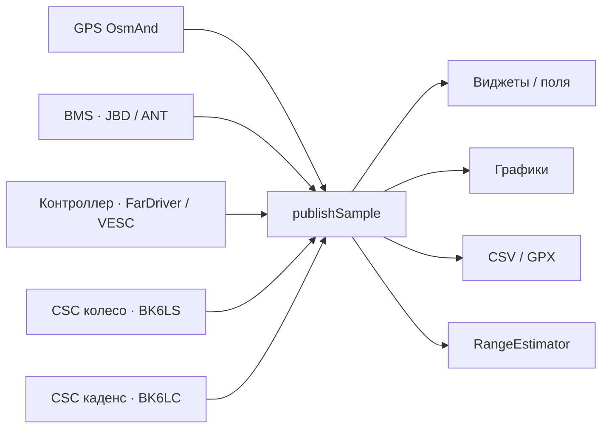

# EV-Telemetry: поля, источники, частоты и формулы

Документ описывает **все поля**, которые плагин пишет в `EvTelemetry` и показывает во вкладке полей / CSV / графиках.

Код: `OsmAnd/src/net/osmand/plus/plugins/evbms/`  
Перечень полей: `TelemetryField.kt`. Снимок: `EvBmsPlugin.publishSample()`.

Протокол BMS (кадры JBD / ANT, авторизация, GATT) — отдельно в [`BMS_DATA_ABOUT.md`](BMS_DATA_ABOUT.md).

---

## 1. Конвейер

Четыре BLE-роли и GPS OsmAnd сходятся в один снимок `EvTelemetry`.

| Источник | Как приходят данные | Типичная частота | «Свежие» |
|---|---|---|---|
| **GPS** | `updateLocation` OsmAnd | ~1 Гц | пока есть `Location` |
| **BMS** | запрос–ответ по `BMS_POLL_MS` | **500 мс (2 Гц)** по умолчанию; 200…10000 мс | `max(5 с, 3 × poll)` |
| **Контроллер FarDriver** | один `startStatus`, дальше поток кадров `AA…` | кадры непрерывно; в снимок — на тике опроса | как BMS, от `CONTROLLER_POLL_MS` |
| **Контроллер VESC** | чередование `GET_VALUES` / `GET_VALUES_SETUP` | **200 мс (5 Гц)** по умолчанию | то же |
| **Колесо CSC** | GATT notify `0x2A5B`, без poll | ~0.5–2 Гц; на стоянке часто молчит | 4 с |
| **Каденс CSC** | тот же CSC Measurement | как колесо | пока есть обороты педалей |

Тик плагина `pollRunnable`: `min(BMS_poll, CTRL_poll)` → по умолчанию **200 мс**. На каждом тике вызывается `publishSample()`, даже если BLE молчит (тогда в снимок идут последние значения).

Режим «Поход»: оба poll не чаще **5 с**.

Дополнительно, вне тика:

| Поток | Интервал | Зачем |
|---|---|---|
| `publishWheelLive()` | каждый CSC notify | скорость / одометр колеса / каденс без ожидания poll |
| `RangeEstimator.add()` | **1 с**, только не на зарядке | запас хода и энергия |
| Живые графики | **500 мс**, до 480 точек (~4 мин) | вкладка графиков |
| CSV / GPX | **1 с** по умолчанию; «как poll», 0.5 / 2 / 5 с | неизменённый fingerprint строки не пишется |
| История заряда / пробега | **2 с** | вкладка истории |

Энергия и запас хода **не** считают ток контроллера: в `RangeEstimator` ток попадает только если BMS свежий (`bmsFresh`). Знак тока JBD: **плюс = заряд в пакет**, минус = разряд.

---

## 2. Откуда сырьё

### 2.1. GPS

`lastLocation`: широта, долгота, `speed × 3.6` → км/ч. Точность > 40 м или скачок относительно одометра помечает GPS как ненадёжный (`gpsUnreliable`) — тогда дистанция для запаса хода GPS не берёт.

### 2.2. BMS

`BmsSnapshot` после разбора кадра:

| Поле снимка | JBD `0x03` / `0x04` | ANT status `0x11` |
|---|---|---|
| `voltageV` | u16 × 10 мВ | u16 LE × 0.01 В |
| `currentA` | s16 × 10 мА | s16 LE × 0.1 А |
| `remainingMah` / `fullMah` | u16 × 10 мА·ч | u32 × 10⁻⁶ А·ч |
| `socPercent` | байт регистра | u16 % |
| `cycles` | u16 | **всегда 0** |
| `temperaturesC` | NTC (K−273.1) | NTC в кадре |
| ячейки | отдельный `0x04`, чередуется с `0x03` | в том же status |

Полный снимок ячеек JBD = **два опроса**. ANT — всё в одном кадре.

### 2.3. Контроллер

**FarDriver** (кадры 16 байт, адрес flash):

| Адрес | Что | В снимок |
|---|---|---|
| `0xE2` | импульсы колеса, передача | `rawRpm` / `measureSpeed`, `gear` 1…4 |
| `0xE8` | V пакет, ток линии | `voltageV` = u16/10; `lineCurrentA` = s16/4 |
| `0xF4` | температура мотора | `motorTempC` |
| `0xD6` | температура контроллера | `controllerTempC` |
| `0x69` + `0x7C` | одометр LSB/MSB | `odometerKm = (msb≪16 \| lsb) / 10` |
| `0xD0` | средний Вт·ч/км, геометрия колеса | `avgPowerWhPerKm`, `rateRatio`, радиус |

Скорость FarDriver:  
`pulses × 0.00376991136 × (radius×1270 + width×wheelRatio) / rateRatio`  
Мощность: `V × I` линии.

**VESC** (`COMM_GET_VALUES` / `SETUP`):

| Поле | Формула |
|---|---|
| напряжения / токи | i16/10 В, i32/100 А |
| RPM | i32 erpm |
| скорость | `speedMps × 3.6` из SETUP |
| одометр | `distanceAbsM / 1000` км |
| мощность | `V × currentInA` |
| средний Вт·ч/км | `wattHours / odometerKm`, если есть оба |

Калибровка `SPEED_CAL_FACTOR` (0.5…2) умножает **скорость и одометр контроллера**, не CSC.

### 2.4. CSC колесо (BK6LS)

GATT 0x1816, флаг bit0. Накопительные обороты u32 + время события u16 (1024 тика/с).

\[
\Delta s = \Delta N \times C \times k,\quad
v = \Delta s / \Delta t
\]

\(C\) — окружность (по умолчанию 2.00 м), \(k\) — калибровка датчика. На стоянке датчик повторяет последний кадр: скорость обнуляется по wall-clock (2.5…5 с), одометр **не** откатывается.

`odometerKm` — накопительный пробег датчика (для запаса хода).  
`tripKm` — пробег **сессии** (поле «одометр колеса»).

### 2.5. CSC каденс (BK6LC)

Флаг bit1. Обороты педалей u16 + время события u16. Если в кадре есть и колесо, коленвал начинается со смещения 7.

\[
\text{rpm} = \Delta N_{\text{crank}} \times 60 / \Delta t
\]

Потолок 240 об/мин. Тишина → 0 после ~1.5…4 с. Каденс также разбирается из кадра BK6LS, если там есть crank-блок.

---

## 3. Поля телеметрии

Частота колонки «в UI» — как часто значение **может** смениться. Снимок всё равно публикуется каждые ~200 мс.

### 3.1. GPS

| id | UI | Источник | Частота | Как считается |
|---|---|---|---|---|
| `time_ms` | Время | часы телефона | каждый снимок | `System.currentTimeMillis()`; в UI `HH:mm:ss` |
| `lat` | Широта | GPS | ~1 Гц | `Location.latitude` |
| `lon` | Долгота | GPS | ~1 Гц | `Location.longitude` |
| `gps_speed_kmh` | Скорость GPS | GPS | ~1 Гц | `speed × 3.6`, без калибровки |

### 3.2. Батарея

| id | UI | Источник | Частота | Как считается |
|---|---|---|---|---|
| `soc_percent` | SOC | BMS А·ч, иначе OCV, иначе байт BMS | poll BMS | \(100 \times remainingAh / fullAh\), округление 0…100. Если А·ч нет — `soc_ocv`. Иначе `BmsSnapshot.socPercent` |
| `soc_ocv_percent` | SOC по напряжению | min-ячейка + ток | poll BMS | `SocCalibrator`: OCV = \(V_{min} \pm I·R_{cell}\) (плюс под нагрузкой, минус на заряде). Кривая NMC или LFP. Сглаживание \(0.65·prev + 0.35·raw\) |
| `voltage_v` | Напряжение | BMS, иначе контроллер | poll | пакет BMS; fallback FarDriver/VESC |
| `current_a` | Ток | BMS, иначе контроллер | poll | BMS, если свежий и \|I\| ≥ 0.2 А; иначе ток контроллера. **Плюс = заряд** |
| `remaining_ah` | Остаток А·ч | BMS | poll / 2 poll JBD | `remainingMah / 1000` |
| `full_ah` | Полная А·ч | BMS | как остаток | `fullMah / 1000` |
| `bms_temp_c` | Температура батареи | NTC BMS | poll | май–сентябрь: **max** NTC; иначе **min** (`batteryAnnounceTempC`) |
| `cycles` | Циклы | JBD | poll пакета | ANT не отдаёт (0) |
| `min_cell_v` | Слабая ячейка | массив ячеек | JBD: 2 poll; ANT: каждый | `min(cells)` |
| `max_cell_v` | Сильная ячейка | массив ячеек | то же | `max(cells)` |
| `cell_imbalance_v` | Разбаланс | min и max | то же | \(V_{max} - V_{min}\); в UI мВ; нужно ≥ 2 ячеек |
| `range_km` | Запас хода | `RangeEstimator` | **1 с** | см. §4. Основной: Вт·ч ост. / Вт·ч/км за **10 км** |

### 3.3. Контроллер

| id | UI | Источник | Частота | Как считается |
|---|---|---|---|---|
| `controller_voltage_v` | Напряжение контроллера | FarDriver `0xE8` / VESC | поток / poll | сырое V контроллера |
| `controller_current_a` | Ток контроллера | линия FarDriver / `currentIn` VESC | то же | не идёт в энергию запаса хода |
| `power_w` | Мощность | контроллер | то же | \(V \times I\) контроллера |
| `rpm` | Обороты | FarDriver импульсы / VESC erpm | то же | целое; у FarDriver это `measureSpeed`, не механические RPM колеса |
| `gear` | Передача | FarDriver `0xE2` | то же | 1…4; у VESC нет |
| `motor_temp_c` | Температура мотора | FarDriver `0xF4` / VESC | то же | °C |
| `controller_temp_c` | Температура контроллера | FarDriver `0xD6` / VESC MOS | то же | °C |
| `odometer_km` | Одометр | сессия контроллера, иначе колесо | poll + notify | \( (odo_{ctrl} - odo_{start}) \times k_{cal} \); нет контроллера → `tripKm` колеса. Сброс только при **старте новой записи** телеметрии |
| `controller_trip_km` | Пробег контроллера | то же | то же | только сессия контроллера, без подмены колесом |
| `controller_speed_kmh` | Скорость контроллера | колесо, иначе контроллер | notify / poll | `wheelSpeedKmh() ?: controllerSpeedKmh()`. Калибровка контроллера, если колеса нет. На стоянке при живом GATT колеса → **0** |

### 3.4. Поездка

| id | UI | Источник | Частота | Как считается |
|---|---|---|---|---|
| `range_window_km` | Запас (5 мин) | `RangeEstimator` | 1 с | остаток Вт·ч / Вт·ч/км окна **5 мин** |
| `range_pnz_km` | Запас на заряде (ПНЗ) | `RangeEstimator` | 1 с | остаток Вт·ч / средний Вт·ч/км **с конца зарядки**, минимум 2 км и 50 Вт·ч |
| `wheel_speed_kmh` | Скорость колеса | BK6LS | notify | \(\Delta s/\Delta t\); не свежий и GATT жив → 0 |
| `wheel_odometer_km` | Одометр колеса | `CscWheelTracker.tripKm` | notify | сумма \(\Delta N·C·k\) с последнего старта записи. Накопительный `odometerKm` для запаса хода **не** сбрасывается |
| `cadence_rpm` | Каденс | BK6LC (или crank в кадре BK6LS) | notify | обороты педалей × 60 / Δt |
| `consumption_wh_km` | Суммарный расход | `RangeEstimator.tripWh` | 1 с | **Вт·ч поездки**, не Вт·ч/км. \(\sum \Delta Ah \times V_{avg}\); если ΔА·ч ≈ 0 — \(-I_{BMS} \times V \times \Delta t\). Ток контроллера не используется |
| `used_ah` | Расход заряда | BMS остаток | poll | \(Ah_{start} - Ah_{now}\) с конца зарядки; иначе интеграл `RangeEstimator` |
| `coverage_wh_km` | Удельный расход | `RangeEstimator` | 1 с | приоритет: **10 км** → окно 5 мин → ПНЗ → средний Вт·ч/км контроллера |
| `charge_trip_km` | Пробег от зарядки | дистанция RangeEstimator | 1 с | на зарядке = 0; иначе `tripDistanceKm` с конца заряда (колесо → GPS → контроллер → v×t) |
| `range_reserve_km` | Запас vs маршрут | запас хода − остаток маршрута OsmAnd | 1 с + маршрут | какой запас — настройка (10 км / 5 мин / ПНЗ) |
| `stop_time_ms` | Время стоянки | порог «стоянки» км/ч | тик | сейчас стоит: `now - stillSinceMs`; иначе длительность **последней** остановки |

---

## 4. Запас хода и энергия

Пробы раз в 1 с, пока нет зарядки. Дистанция шага, в порядке отказа:

1. **Δ одометра колеса** (накопительный `odometerKm`, на стоянке GPS не подмешивается: Δ ≈ 0 → шаг 0).
2. GPS haversine, если не `gpsUnreliable` (точность ≤ 40 м, нет скачка относительно одометра).
3. Δ одометра контроллера (заднее колесо может буксовать).
4. \(v \times \Delta t\) по спидометру, если 2…160 км/ч.

Потолок шага: не быстрее 160 км/ч и не больше 0.5 км за тик.

**Остаток энергии:**

\[
E = Ah_{ost} \times V \times f_{cell} \times f_{T}
\]

- \(V\) — напряжение пакета; на стоянке может браться «rest»-напряжение.
- \(f_{cell} = \mathrm{clamp}((V_{min}-3.00)/(3.50-3.00), 0.05, 1)\), ещё делится на \(Ah_{ost}/Ah_{full}\), если ячейка слабее кулоновского SOC.
- \(f_{T}\): ≥ 20 °C → 1; 0…20 °C линейно 0.8…1; холоднее — до 0.5. После 3 км окна 10 км температура **не** режет (\(f_T = 1\)).

**Запас км** = \(E / (\text{Вт·ч/км})\). Профиль маршрута (опция): к удельному расходу добавляется \((m g h_{climb}/0.80 - m g h_{descent}·0.55) / 3600 / s_{left}\). Масса = мотоцикл + водитель (по умолчанию 200+80 кг).

Сглаживание основного запаса: не скачет больше \(\max(3\,\text{км}, 15\%)\) за шаг, затем \(0.7·prev + 0.3·limited\).

`RangeEstimator.reset()` при старте **новой** записи телеметрии — окна 5 мин / 10 км начинаются заново. ПНЗ живёт от сессии «после зарядки», не от CSV.

---

## 5. Сброс одометров сессии

Сбрасываются **только** когда пользователь **останавливает запись и начинает новую**:

| Поле | Что обнуляется | Что сохраняется |
|---|---|---|
| Одометр колеса | `tripKm` | накопительный `odometerKm` (запас хода, калибровка) |
| Пробег контроллера | якорь `farTripStartKm = odo_{сейчас}` | железный одометр FarDriver/VESC |
| Одометр | то же, что пробег контроллера (или `tripKm`) | — |

Не сбрасываются: остановка, сон CSC, переподключение BLE, пауза записи, `resume`. Якоря пишутся в prefs (`ev_bms_speed_sensor_trip_km`, `ev_bms_ctrl_trip_start_km`).

---

## 6. Запись и графики

Выбранные поля (`TELEMETRY_FIELDS`) идут в CSV. Радио GPX (`TELEMETRY_GPX_FIELDS`) — в трек плагина, если не пишется штатный трек OsmAnd.

График строится по тем же выбранным полям, кроме `time_ms` / `lat` / `lon`. Разбаланс на графике — **мВ**. Время стоянки — **секунды**.

Каденс (`cadence_rpm`) в списке полей и на графиках по умолчанию включён.

---

## 7. Карта файлов

| Файл | Роль |
|---|---|
| `TelemetryField.kt` | id, подписи, CSV, график |
| `EvTelemetry.kt` | снимок |
| `EvBmsPlugin.kt` | poll, сборка снимка, сессии одометров |
| `RangeEstimator.kt` | энергия, дистанция, три запаса хода |
| `SocCalibrator.kt` | SOC по OCV |
| `protocol/JbdBmsProtocol.kt`, `AntBmsProtocol.kt` | BMS |
| `protocol/FarDriverProtocol.kt`, `VescProtocol.kt` | контроллер |
| `protocol/CscWheelTracker.kt`, `CscCadenceTracker.kt` | CSC |
| `ble/EvBleUartClient.kt` | четыре GATT-роли |
| `TelemetryRecorder.kt` | CSV / GPX |
| `BMS_DATA_ABOUT.md` | кадры JBD/ANT и BLE-сессия BMS |
