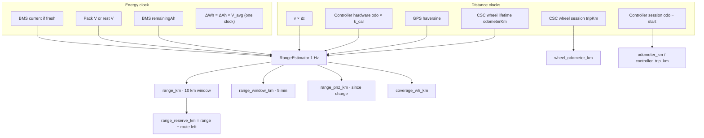
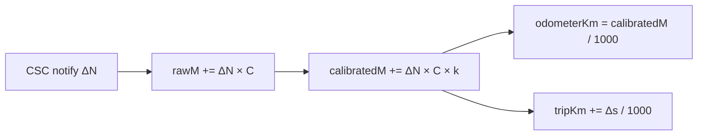
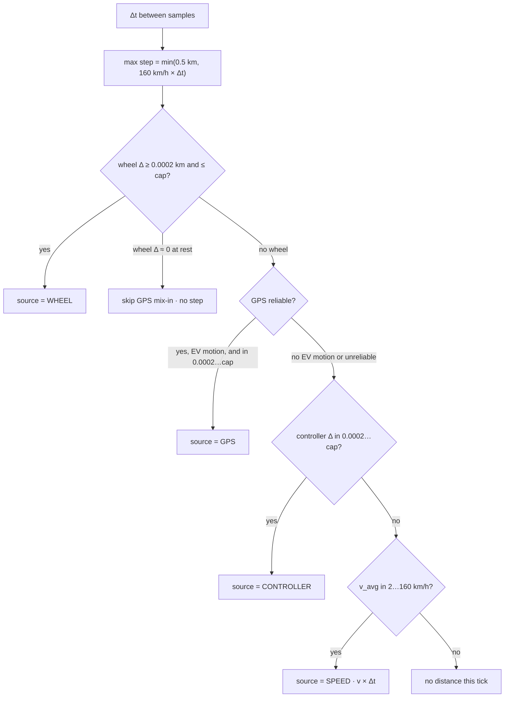
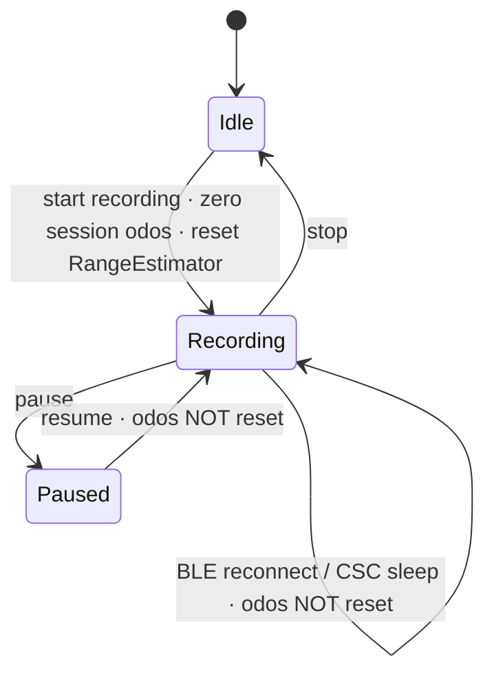
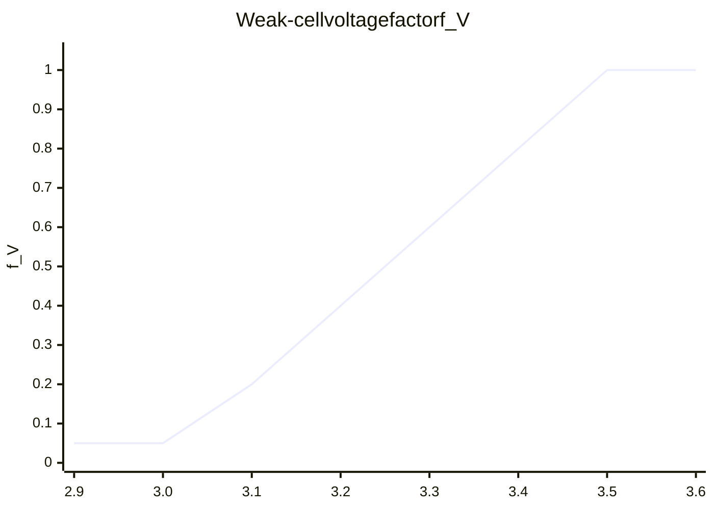
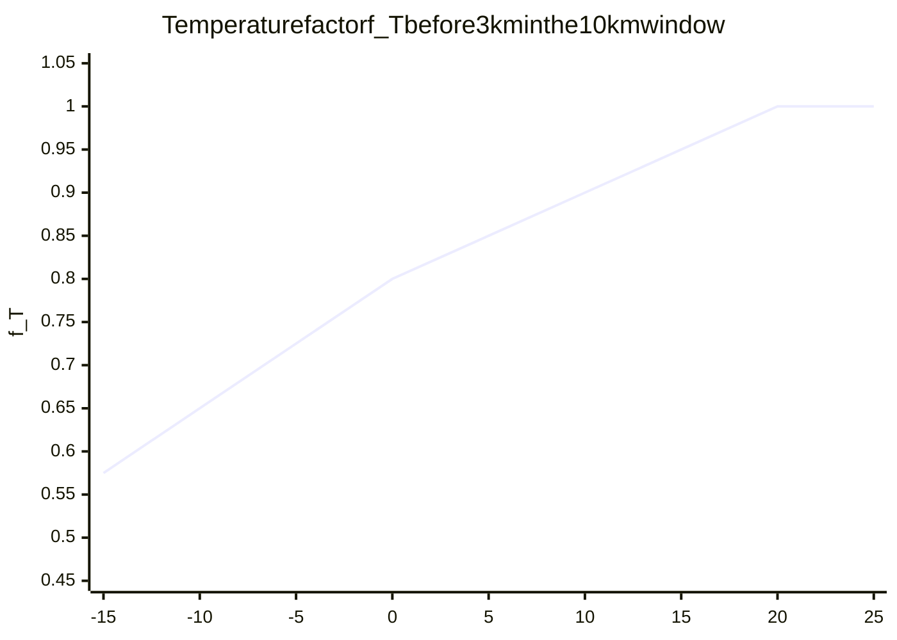
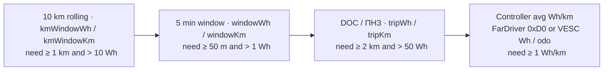
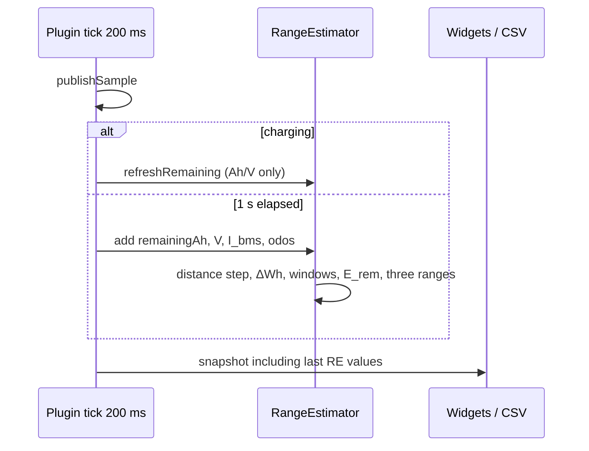

# Calculation methodology: distance, energy, remaining range

This document is the **authoritative description** of how EV-Telemetry computes odometers, energy, remaining pack energy, remaining range, and related fields.

Code: `RangeEstimator.kt`, `CscWheelTracker.kt`, `SocCalibrator.kt`, `EvBmsPlugin.kt`.  
Field list: [`EV-Telemetry.md`](EV-Telemetry.md). BMS frames: [`BMS_DATA_ABOUT.md`](BMS_DATA_ABOUT.md).

JBD current sign used throughout: **positive = charge into the pack**, negative = discharge. Controller current is **not** used for remaining-range energy.

Worked example (22 Aug 2026, why trip Wh was ~1.5× the next charge, and why remaining range was not): [`EnergyConsumptionCalculations.md`](EnergyConsumptionCalculations.md).

---

## 1. Overview

Four independent distance clocks and one energy clock feed three remaining-range estimates.

`RangeEstimator.add()` runs **once per second while riding**. While charging, `refreshRemaining()` updates remaining Wh/range from the new Ah without accumulating trip distance or Wh/km.

---

## 2. Odometers (mileage)

There are **five** distance quantities. Mixing them is the usual source of “the odo jumped / reset” reports.

| Quantity | Code | UI field | Lifetime | Reset |
|---|---|---|---|---|
| Wheel **lifetime** | `CscWheelTracker.odometerKm` | — (internal) | Persisted `ev_bms_speed_sensor_odo_km` | Never (BLE reconnect / rest / pause keep it) |
| Wheel **session** | `CscWheelTracker.tripKm` | `wheel_odometer_km` | Prefs `ev_bms_speed_sensor_trip_km` | **New telemetry recording only** |
| Controller **hardware** | FarDriver `(msb≪16 \| lsb)/10` or VESC `distanceAbsM/1000` | — | On the controller | Never by the plugin |
| Controller **session** | `(odo_now − odo_start) × k_cal` | `controller_trip_km`; also `odometer_km` when a controller exists | Prefs `ev_bms_ctrl_trip_start_km` | **New telemetry recording only** |
| Range **trip** | `RangeEstimator.tripDistanceKm` | `charge_trip_km` (0 while charging) | RAM; reset on new recording **and** on `markTripBoundary` after a charge | New recording / after charge session |

`odometer_km` = controller session if a controller odo exists, else wheel session. It is **not** the wheel lifetime used for remaining range.

### 2.1. Wheel (CSC BK6LS)

GATT 0x1816, flag bit 0: cumulative revolutions `N` (u32 LE) + event time `t` (u16, 1024 ticks/s).

\[
\Delta s = \Delta N \times C \times k,\qquad
v = \frac{\Delta s}{\Delta t}
\]

| Symbol | Meaning | Default / limits |
|---|---|---|
| \(C\) | Circumference | 2.00 m (1200…2800 mm) |
| \(k\) | Sensor calibration `SPEED_SENSOR_CAL_FACTOR` | 1.0, clamp 0.5…2.0 |
| \(\Delta N\) | Revolutions since previous notify | Reject if \(> 80\) or wrap-back of more than 8 revs |
| \(\Delta t\) | CSC event-time delta if 0.02…8 s, else wall-clock | Tick wrap: \(t_{cur} + 65536 - t_{prev}\) |

At rest cheap sensors **repeat the last frame**. Speed coasts to 0 after \(\max(2.5\,\text{s},\; 2.5 \times \text{last rev period},\; 2\times\text{notify}+0.4\,\text{s})\), capped at 5 s. **Odometer does not roll back.**

Lifetime vs session:

### 2.2. Controller session

\[
d_{\text{ctrl}} = (odo_{\text{hw}} - odo_{\text{start}}) \times k_{\text{ctrl}}
\]

\(k_{\text{ctrl}}\) = `SPEED_CAL_FACTOR` (0.5…2). Anchor `odo_start` is stored when a **new recording** starts (`resetSessionOdometers`). Pause / BLE drop / rest **do not** move the anchor.

### 2.3. Distance step for remaining range

Every 1 s sample, **first match wins** (`RangeEstimator.chooseDistanceKm`):

GPS is used for a distance step only when there is **EV motion evidence** (controller/wheel rotating, or BMS discharging above idle). Walking with the phone, a dead BLE link, or GPS jitter at a stop does not add kilometres. A short 8 s grace covers a brief BLE drop while actually riding.

**GPS is unreliable** (`gpsUnreliable`) if any of:

- reported accuracy \(> 40\) m,
- no two coordinates,
- implied speed \(> 160\) km/h,
- GPS haversine \(> 50\) m **and** \(> 3\times\) odometer delta \(+ 30\) m (jump vs wheel/controller).

Wheel delta for range uses **lifetime** `odometerKm`, not session `tripKm`. If the CSC GATT is connected but stale, the lifetime odo is used only when GPS speed \(< 3\) km/h (so a sleeping sensor at a stop does not freeze range, but a moving bike without notifies does not invent distance).

Controller odo for range is used only while the controller BLE snapshot is **fresh**. Rear wheel slip is why it is third in the chain.

### 2.4. Session reset policy

Reset **only** when the user **stops recording and starts a new one** (`startTelemetryRecording` → `resetSessionOdometers` + `rangeEstimator.reset()`).

| Event | Wheel tripKm | Controller session | RangeEstimator windows |
|---|---|---|---|
| New recording | **0** | **re-anchor** | **reset** (5 min / 10 km / DOC start over) |
| Pause / resume | keep | keep | keep |
| BLE reconnect | keep | keep | keep |
| Charge start | keep | keep | `refreshRemaining` only (no trip km / Wh/km) |
| Charge end + 1 km | keep | keep | new DOC session (`markTripBoundary` / trip finish) |

---

## 3. Energy consumption (Wh, Ah)

Energy is a **coulomb integral on the BMS**, independent of GPS and of controller current.

### 3.1. Segment charge (Ah)

Between consecutive 1 s samples use **one** clock, never both:

\[
\Delta Ah =
\begin{cases}
-I_{\text{BMS}} \times \Delta t_{\text{h}} & \text{if } |I| \ge 0.15\,\text{A} \\
Ah_{\text{prev}} - Ah_{\text{cur}} & \text{otherwise, if } |\Delta Ah_{\text{BMS}}| \ge 0.0005\,\text{Ah}
\end{cases}
\]

If remaining Ah is stuck, older builds also added \(I \times V \times \Delta t\) **and** later added \(\Delta Ah \times V\) when the BMS counter ticked — the same coulombs twice (~1.5× trip Wh vs the next charge). Current builds keep a single clock.

If \(\Delta Ah < -0.25\) Ah in one second (charge discontinuity / BMS jump), the segment is **dropped** (neither trip Wh nor the 10 km window).

### 3.2. Segment energy (Wh)

\[
\Delta Wh = \Delta Ah \times \frac{V_{\text{prev}}+V_{\text{cur}}}{2}
\]

If remaining Ah did not move and current is missing, \(\Delta Wh = 0\).

`I` is passed only when the BMS snapshot is **fresh**. Controller line current never enters this integral.

Trip totals:

\[
Wh_{\text{trip}} = \sum \Delta Wh,\qquad
Ah_{\text{trip}} = \max\bigl(0,\; \sum \Delta Ah\bigr)
\]

UI `consumption_wh_km` is **trip watt-hours** (`energyWh`), **not** Wh/km. Specific consumption is `coverage_wh_km` / the 5 min window field.

### 3.3. Used Ah in the UI

`used_ah` while riding:

1. \(Ah_{\text{start}} - Ah_{\text{now}}\) since the trip/charge-end boundary, if both exist;
2. else `RangeEstimator.tripUsedAh`.

Zero / hidden while charging.

### 3.4. Charge energy (into the pack)

While a charge session is open and \(I \ge 0.15\) A:

\[
Wh_{\text{charge}} += V \times I \times \Delta t_{\text{h}}
\]

ETA to full:

\[
t_{\text{left}} = \frac{Ah_{\text{full}} - \bigl(Ah_{\text{last}} + I \times \Delta t_{\text{h}}\bigr)}{I}
\]

(minimum 5 min when \(Ah_{\text{left}} \le 0.05\)).

---

## 4. Full and remaining pack energy

### 4.1. Coulomb capacity (from BMS)

| Quantity | Formula | Source |
|---|---|---|
| Remaining \(Ah_{\text{rem}}\) | `remainingMah / 1000` | JBD `0x03` / ANT status |
| Full \(Ah_{\text{full}}\) | `fullMah / 1000` | same |
| Coulomb SOC | \(\mathrm{round}(100 \times Ah_{\text{rem}} / Ah_{\text{full}})\) | used as `soc_percent` when Ah exists |

Full energy (nominal, not used for range):

\[
E_{\text{full}} \approx Ah_{\text{full}} \times V_{\text{pack}}
\]

The plugin does **not** store a separate “design Wh”. Range uses **remaining energy** below, not \(E_{\text{full}} \times SOC\).

### 4.2. Remaining energy for range

\[
E_{\text{rem}} = Ah_{\text{rem}} \times V_{\text{energy}} \times f_{\text{cell}} \times f_{T}
\]

| Term | Value |
|---|---|
| \(Ah_{\text{rem}}\) | effective remaining Ah: BMS coulomb, unless the BMS claims near-full while the **weak cell** is not at rest-full (NMC 4.12 V / LFP 3.45 V) — then \(Ah_{\text{full}} \times SOC_{\text{OCV}}/100\) |
| \(V_{\text{energy}}\) | last **true rest** pack V (\(\|I\| \le 5\) A **and not charging**); else IR-compensated pack OCV; never the inflated charge voltage |
| \(f_{\text{cell}}\) | weak-cell factor, §4.3 |
| \(f_{T}\) | temperature factor, §4.4; **forced to 1** after 3 km in the 10 km window |

Rest voltage (`updateRestMetrics`): when \(\|I\| \le 5\) A **and the charge session is closed**, remember pack V. Charge current and BMS OV protection (near-zero I at high V) must not latch as rest.

### 4.3. Weak-cell factor

LVC 3.00 V, “healthy” 3.50 V:

\[
f_{V} = \mathrm{clamp}\!\left(\frac{V_{\min}-3.00}{3.50-3.00},\; 0.05,\; 1\right)
\]

If coulomb SOC \(f_{Ah} = Ah_{\text{rem}}/Ah_{\text{full}}\) exists and the weak cell is **worse** than coulomb SOC:

\[
f_{\text{cell}} = \mathrm{clamp}(f_{V} / f_{Ah},\; 0.05,\; 1)
\]

otherwise \(f_{\text{cell}} = 1\) when \(f_{V} \ge f_{Ah}\), or \(f_{V}\) if full Ah is unknown.

Interpretation: a pack at 40% coulomb SOC with one cell at 3.10 V (\(f_V = 0.20\)) gets \(f_{\text{cell}} = 0.20/0.40 = 0.50\) — remaining Wh is halved so range tracks the **first cell to LVC**, not the Ah counter.

### 4.4. Temperature factor

Uses the **coldest** BMS NTC for range (not the seasonal announce temperature).

\[
f_{T} =
\begin{cases}
1.00 & T \ge 20^\circ\mathrm{C} \\
0.80 + 0.20 \times T/20 & 0 \le T < 20 \\
\mathrm{clamp}(0.65 + 0.015(T+10),\; 0.50,\; 0.80) & T < 0
\end{cases}
\]

After **3 km** accumulated in the 10 km rolling window, \(f_T = 1\) (the window already contains cold-weather Wh/km).

### 4.5. Voltage SOC (`soc_ocv_percent`)

`SocCalibrator` estimates SOC from **min cell OCV**, independent of the Ah counter.

\[
V_{\text{OCV}} =
\begin{cases}
V_{\min} - |I|\,R_{\text{cell}} & \text{charging} \\
V_{\min} & \text{rest }(|I| < 2\,\text{A}) \\
V_{\min} + |I|\,R_{\text{cell}} & \text{load}
\end{cases}
\]

\(R_{\text{cell}}\) is learned from sag vs later rest (1.5…60 mΩ, default 12 mΩ). Chemistry (NMC vs LFP) is inferred from rest OCV. Display SOC is smoothed:

\[
SOC \leftarrow 0.65 \times SOC_{\text{prev}} + 0.35 \times SOC_{\text{raw}}
\]

NMC lookup (V → %): 3.00→0, 3.40→5, 3.50→10, 3.62→20, 3.70→30, 3.76→40, 3.82→50, 3.87→60, 3.93→70, 4.00→80, 4.08→90, 4.20→100.  
LFP: 2.50→0, 3.00→5, 3.20→10, 3.26→20, 3.29→40, 3.31→60, 3.33→80, 3.34→90, 3.36→95, 3.40→100.

`soc_percent` prefers coulomb Ah from **effective** remaining Ah (weak-cell OCV when the BMS jumps to 100% on a strong-cell HVC). OCV is also a separate field. Full-voltage learning is **not** done while charging.

---

## 5. Specific consumption (Wh/km)

Four candidates. **Coverage** (`coverage_wh_km`) is the first that exists:

\[
w_{\text{cov}} = w_{10\,\text{km}} \;\text{else}\; w_{5\,\text{min}} \;\text{else}\; w_{\text{DOC}} \;\text{else}\; w_{\text{ctrl}}
\]

The 10 km window is a deque of \((\Delta km, \Delta Wh)\) segments; oldest segments drop when the sum exceeds 10 km.

The 5 min window is the same energy/distance reconstructed from samples still in `samples` (trimmed to `windowMs = 5 min`).

`consumptionWhPerKm` in code is the **5 min** ratio. Ah/km (`consumptionAhPerKm`) is \(\Delta Ah_{5min}/d_{5min}\) when \(\Delta Ah > 0.01\).

---

## 6. Remaining range (all kinds)

\[
R = \frac{E_{\text{rem}}}{w_{\text{effective}}}
\]

| UI field | id | \(w\) | Notes |
|---|---|---|---|
| Remaining range | `range_km` | 10 km rolling, else 5 min, else DOC, else controller | **Smoothed** (§6.2) |
| Range (5 min) | `range_window_km` | 5 min window only | Raw, no extra smoothing |
| Range on charge (DOC / ПНЗ) | `range_pnz_km` | trip since charge, ≥ 2 km and 50 Wh | Raw |
| Range reserve | `range_reserve_km` | selected range − OsmAnd route left | Which range: setting 10 km / 5 min / DOC |

If \(w < 1\) Wh/km after profile correction, it is clamped to 1. Range is \(\ge 0\).

### 6.1. Route elevation profile (optional)

If `USE_ROUTE_PROFILE` is on and a route is calculated:

\[
w_{\text{eff}} = w + \frac{m g h_{\text{climb}} / \eta_{\text{drive}} - m g h_{\text{descent}} \times \eta_{\text{regen}}}{3600 \times s_{\text{left}}}
\]

| Symbol | Value |
|---|---|
| \(m\) | vehicle + rider (default 200 + 80 = 280 kg) |
| \(g\) | 9.81 m/s² |
| \(\eta_{\text{drive}}\) | 0.80 |
| \(\eta_{\text{regen}}\) | 0.55 |
| \(h_{\text{climb}}, h_{\text{descent}}\) | remaining route altitudes from OsmAnd `routeLocations` |
| \(s_{\text{left}}\) | remaining route km (`leftDistance / 1000`) |

Climb adds Wh/km; descent credits 55% regen. Applied to **each** range flavour that has a \(w\).

### 6.2. Primary-range smoothing

Only `range_km` (not 5 min / DOC):

1. Clamp the raw jump to \(\pm \max(3\,\text{km},\; 0.15 \times R_{\text{prev}})\).
2. Blend \(R \leftarrow 0.7\,R_{\text{prev}} + 0.3\,R_{\text{limited}}\).

First finite value is taken as-is. This stops tunnel GPS and a single Wh spike from flashing 80→20→80 km.

### 6.3. Worked example

Pack 20 Ah remaining, 72 V rest, min cell 3.40 V, 15 °C, 8 km already in the 10 km window at 90 Wh/km, 2 km still needed to disable \(f_T\). Coulomb full 30 Ah.

- \(f_{Ah} = 20/30 \approx 0.667\)
- \(f_V = (3.40-3.00)/0.50 = 0.80 > f_{Ah}\) → \(f_{\text{cell}} = 1\)
- \(f_T = 0.80 + 0.20\times 15/20 = 0.95\) (window still \(< 3\) km of *this* window’s 3 km rule uses `kmWindowKm`; here 8 km ⇒ \(f_T = 1\))
- \(E_{\text{rem}} = 20 \times 72 \times 1 \times 1 = 1440\) Wh
- \(R_{10} = 1440 / 90 = 16.0\) km before smoothing

If the same pack had min cell 3.10 V: \(f_V = 0.20\), \(f_{\text{cell}} = 0.20/0.667 \approx 0.30\), \(E_{\text{rem}} = 432\) Wh, \(R_{10} \approx 4.8\) km.

---

## 7. Range vs route (reserve)

\[
R_{\text{reserve}} = R_{10\,\text{km}} - s_{\text{next}}
\]

\(R_{10\,\text{km}}\) is the **primary** remaining range. \(s_{\text{next}}\) is distance to the **next intermediate** (charging stop) when one exists, otherwise remaining distance to the destination. Voice thresholds default **5 km** (small) and **15 km** (low remaining reserve). No route ⇒ field empty.

The route elevation correction uses the same \(s_{\text{next}}\) cap so climb after the charging stop is not counted.

---

## 8. Related parameters

| Parameter | How it is computed |
|---|---|
| `coverage_wh_km` | §5 |
| `consumption_wh_km` | trip Wh (label is historical; not Wh/km) |
| `used_ah` | §3.3 |
| `charge_trip_km` | 0 while charging; else `RangeEstimator.tripDistanceKm` |
| `weak_cell_factor` | \(f_{\text{cell}}\) published on the snapshot |
| `gps_unreliable` | last 5 min window contained a bad GPS step |
| `usedFarDriverDistance` | a controller step was used in that 5 min window |
| Stop time | still if speed \(<\) stop threshold; else last stop duration |
| Charge ETA | §3.4 |
| Announce battery temp | **max** NTC May–Sep, **min** otherwise — **not** the range \(f_T\) input |

---

## 9. Timing and validity

| Condition | Effect |
|---|---|
| No remaining Ah or \(V \le 0\) | `add()` returns; ranges stay at previous / null |
| Fewer than 2 samples | no recalculation |
| Charging | `refreshRemaining()` so remaining range grows with Ah; Wh/km windows stay frozen. Charge session stays open until the vehicle **moves** (ride-on-charge); BMS OV / MOS-off does not end it |
| New recording | full `reset()` |
| Hike mode | BLE poll ≥ 5 s; range still 1 Hz when samples exist |

---

## 10. Constants (code)

| Constant | Value | Role |
|---|---|---|
| `ROLLING_KM` | 10 km | primary Wh/km window |
| `windowMs` | 5 min | short-term Wh/km and GPS flag |
| `TRIP_RANGE_MIN_KM` | 2 km | DOC minimum distance |
| DOC min energy | 50 Wh | DOC minimum energy |
| `minDistanceKm` | 0.05 km | 5 min window minimum |
| `MAX_PLAUSIBLE_KMH` | 160 | step cap and GPS implied speed |
| Max step | 0.5 km | per tick |
| `MAX_ACCURACY_M` | 40 m | GPS reject |
| `CHARGE_DISCONTINUITY_AH` | 0.25 Ah | drop bogus Ah jump |
| `CELL_LVC_V` / `CELL_HEALTHY_V` | 3.00 / 3.50 V | weak cell |
| `REST_CURRENT_A` | 5 A | rest voltage latch |
| `DRIVE_EFFICIENCY` / `REGEN_EFFICIENCY` | 0.80 / 0.55 | route profile |
| Default mass | 280 kg | 200 vehicle + 80 rider |
| Range sample | 1 s | `RANGE_SAMPLE_MIN_MS` |

---

## 11. File map

| File | Role |
|---|---|
| `RangeEstimator.kt` | distance choice, Wh integral, three ranges, smoothing, \(f_{\text{cell}}\), \(f_T\), route profile |
| `CscWheelTracker.kt` | lifetime / session wheel odometer and speed |
| `EvBmsPlugin.kt` | session anchors, rest V, charge Wh, reserve, SOC, when to `add()` |
| `SocCalibrator.kt` | OCV SOC |
| [`EV-Telemetry.md`](EV-Telemetry.md) | every UI field |
