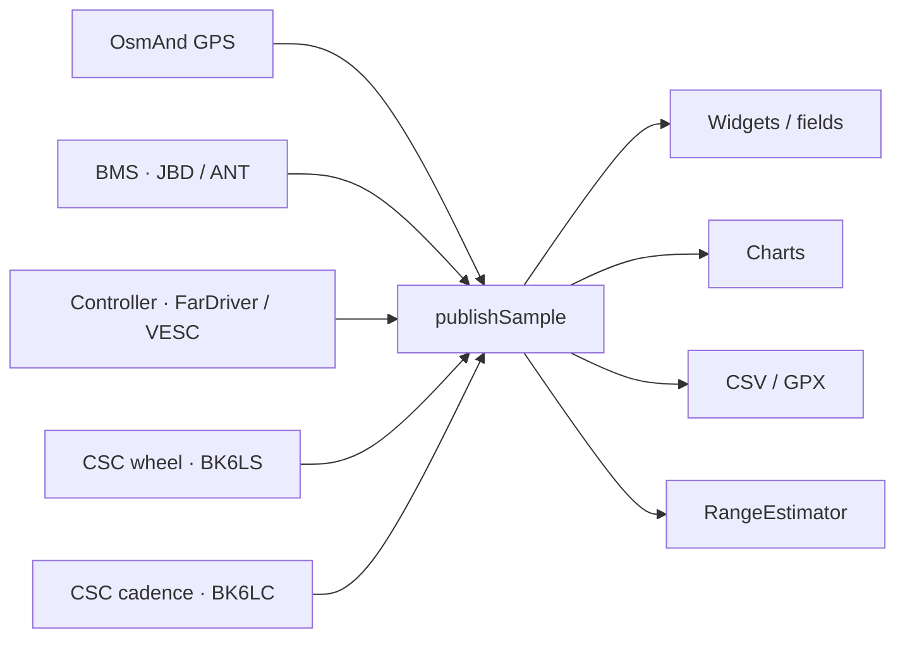

# EV-Telemetry: fields, sources, rates, and formulas

This document lists **every field** the plugin writes into `EvTelemetry` and shows in the fields tab, CSV, and live charts.

Code: `net/osmand/plus/plugins/evbms/` (this directory).  
Field list: `TelemetryField.kt`. Snapshot: `EvBmsPlugin.publishSample()`.

BMS wire protocol (JBD / ANT frames, auth, GATT) is in [`BMS_DATA_ABOUT.md`](BMS_DATA_ABOUT.md).

---

## 1. Pipeline

Four BLE roles plus OsmAnd GPS feed one `EvTelemetry` snapshot.

| Source | How data arrives | Typical rate | Freshness |
|---|---|---|---|
| **GPS** | OsmAnd `updateLocation` | ~1 Hz | while a `Location` exists |
| **BMS** | request–response at `BMS_POLL_MS` | **500 ms (2 Hz)** default; 200…10000 ms | `max(5 s, 3 × poll)` |
| **FarDriver controller** | one `startStatus`, then a stream of `AA…` frames | frames continuously; snapshot on the poll tick | same as BMS, from `CONTROLLER_POLL_MS` |
| **VESC controller** | alternating `GET_VALUES` / `GET_VALUES_SETUP` | **200 ms (5 Hz)** default | same |
| **CSC wheel** | GATT notify `0x2A5B`, no poll | ~0.5–2 Hz; often silent at rest | 4 s |
| **CSC cadence** | same CSC Measurement | same as wheel | while cranks turn |

Plugin tick `pollRunnable`: `min(BMS_poll, CTRL_poll)` → **200 ms** by default. Every tick calls `publishSample()`, even if BLE is silent (the snapshot keeps the last values).

Hike mode: neither poll faster than **5 s**.

Off the tick:

| Stream | Interval | Purpose |
|---|---|---|
| `publishWheelLive()` | every CSC notify | wheel speed / odometer / cadence without waiting for poll |
| `RangeEstimator.add()` | **1 s**, not while charging | remaining range and energy |
| Live charts | **500 ms**, up to 480 points (~4 min) | charts tab |
| CSV / GPX | **1 s** default; “same as poll”, 0.5 / 2 / 5 s | unchanged fingerprint rows are skipped |
| Charge / trip history | **2 s** | history tab |

Energy and remaining range **do not** use controller current: `RangeEstimator` gets current only when the BMS is fresh (`bmsFresh`). JBD current sign: **positive = charge into the pack**, negative = discharge.

---

## 2. Raw sources

### 2.1. GPS

`lastLocation`: latitude, longitude, `speed × 3.6` → km/h. Accuracy worse than 40 m, or a jump versus odometer, marks GPS unreliable (`gpsUnreliable`) — remaining-range distance then ignores GPS.

### 2.2. BMS

`BmsSnapshot` after the frame parser:

| Snapshot field | JBD `0x03` / `0x04` | ANT status `0x11` |
|---|---|---|
| `voltageV` | u16 × 10 mV | u16 LE × 0.01 V |
| `currentA` | s16 × 10 mA | s16 LE × 0.1 A |
| `remainingMah` / `fullMah` | u16 × 10 mAh | u32 × 10⁻⁶ Ah |
| `socPercent` | register byte | u16 % |
| `cycles` | u16 | **always 0** |
| `temperaturesC` | NTC (K−273.1) | NTCs in the frame |
| cells | separate `0x04`, alternated with `0x03` | same status frame |

A full JBD cell snapshot = **two polls**. ANT sends everything in one frame.

### 2.3. Controller

**FarDriver** (16-byte frames, flash address):

| Address | Payload | Snapshot |
|---|---|---|
| `0xE2` | wheel pulses, gear | `rawRpm` / `measureSpeed`, `gear` 1…4 |
| `0xE8` | pack V, line current | `voltageV` = u16/10; `lineCurrentA` = s16/4 |
| `0xF4` | motor temperature | `motorTempC` |
| `0xD6` | controller temperature | `controllerTempC` |
| `0x69` + `0x7C` | odometer LSB/MSB | `odometerKm = (msb≪16 \| lsb) / 10` |
| `0xD0` | average Wh/km, wheel geometry | `avgPowerWhPerKm`, `rateRatio`, radius |

FarDriver speed:  
`pulses × 0.00376991136 × (radius×1270 + width×wheelRatio) / rateRatio`  
Power: line `V × I`.

**VESC** (`COMM_GET_VALUES` / `SETUP`):

| Field | Formula |
|---|---|
| voltage / current | i16/10 V, i32/100 A |
| RPM | i32 erpm |
| speed | `speedMps × 3.6` from SETUP |
| odometer | `distanceAbsM / 1000` km |
| power | `V × currentInA` |
| average Wh/km | `wattHours / odometerKm` when both exist |

`SPEED_CAL_FACTOR` (0.5…2) scales **controller speed and odometer**, not CSC.

### 2.4. CSC wheel (BK6LS)

GATT 0x1816, flag bit 0. Cumulative revolutions u32 + event time u16 (1024 ticks/s).

\[
\Delta s = \Delta N \times C \times k,\quad
v = \Delta s / \Delta t
\]

\(C\) is circumference (default 2.00 m), \(k\) is the sensor calibration. At rest the sensor repeats the last frame: speed coasts to zero on wall-clock (2.5…5 s), odometer **does not** roll back.

`odometerKm` — lifetime sensor distance (used for remaining range).  
`tripKm` — **session** distance (the “wheel odometer” field).

### 2.5. CSC cadence (BK6LC)

Flag bit 1. Crank revolutions u16 + event time u16. If the frame also has wheel data, crank fields start at offset 7.

\[
\text{rpm} = \Delta N_{\text{crank}} \times 60 / \Delta t
\]

Capped at 240 rpm. Silence → 0 after ~1.5…4 s. Cadence is also parsed from a BK6LS frame when the crank block is present.

---

## 3. Telemetry fields

The “in UI” rate is how often the value **can** change. The snapshot is still published about every 200 ms.

### 3.1. GPS

| id | UI | Source | Rate | How it is computed |
|---|---|---|---|---|
| `time_ms` | Time | phone clock | every snapshot | `System.currentTimeMillis()`; UI `HH:mm:ss` |
| `lat` | Latitude | GPS | ~1 Hz | `Location.latitude` |
| `lon` | Longitude | GPS | ~1 Hz | `Location.longitude` |
| `gps_speed_kmh` | GPS speed | GPS | ~1 Hz | `speed × 3.6`, uncalibrated |

### 3.2. Battery

| id | UI | Source | Rate | How it is computed |
|---|---|---|---|---|
| `soc_percent` | SOC | BMS Ah, else OCV, else BMS byte | BMS poll | \(100 \times remainingAh / fullAh\), rounded 0…100. If Ah is missing → `soc_ocv`. Else `BmsSnapshot.socPercent` |
| `soc_ocv_percent` | Voltage SOC | min cell + current | BMS poll | `SocCalibrator`: OCV = \(V_{min} \pm I·R_{cell}\) (plus under load, minus while charging). NMC or LFP curve. Smoothing \(0.65·prev + 0.35·raw\) |
| `voltage_v` | Voltage | BMS, else controller | poll | BMS pack; fallback FarDriver/VESC |
| `current_a` | Current | BMS, else controller | poll | BMS if fresh and \|I\| ≥ 0.2 A; else controller current. **Positive = charge** |
| `remaining_ah` | Remaining Ah | BMS | poll / 2 polls on JBD | `remainingMah / 1000` |
| `full_ah` | Full Ah | BMS | same as remaining | `fullMah / 1000` |
| `bms_temp_c` | Battery temperature | BMS NTCs | poll | May–September: **max** NTC; otherwise **min** (`batteryAnnounceTempC`) |
| `cycles` | Cycles | JBD | pack poll | ANT does not report (0) |
| `min_cell_v` | Weak cell | cell array | JBD: 2 polls; ANT: every poll | `min(cells)` |
| `max_cell_v` | Strong cell | cell array | same | `max(cells)` |
| `cell_imbalance_v` | Imbalance | min and max | same | \(V_{max} - V_{min}\); UI in mV; needs ≥ 2 cells |
| `range_km` | Remaining range | `RangeEstimator` | **1 s** | see §4. Primary: remaining Wh / Wh/km over the last **10 km** |

### 3.3. Controller

| id | UI | Source | Rate | How it is computed |
|---|---|---|---|---|
| `controller_voltage_v` | Controller voltage | FarDriver `0xE8` / VESC | stream / poll | raw controller V |
| `controller_current_a` | Controller current | FarDriver line / VESC `currentIn` | same | not used in remaining-range energy |
| `power_w` | Power | controller | same | controller \(V \times I\) |
| `rpm` | RPM | FarDriver pulses / VESC erpm | same | integer; on FarDriver this is `measureSpeed`, not mechanical wheel RPM |
| `gear` | Gear | FarDriver `0xE2` | same | 1…4; VESC has none |
| `motor_temp_c` | Motor temperature | FarDriver `0xF4` / VESC | same | °C |
| `controller_temp_c` | Controller temperature | FarDriver `0xD6` / VESC MOS | same | °C |
| `odometer_km` | Odometer | controller session, else wheel | poll + notify | \( (odo_{ctrl} - odo_{start}) \times k_{cal} \); no controller → wheel `tripKm`. Resets only when a **new telemetry recording** starts |
| `controller_trip_km` | Controller trip | same | same | controller session only, never substituted by the wheel |
| `controller_speed_kmh` | Controller speed | wheel, else controller | notify / poll | `wheelSpeedKmh() ?: controllerSpeedKmh()`. Controller calibration if there is no wheel. At rest with a live wheel GATT → **0** |

### 3.4. Ride

| id | UI | Source | Rate | How it is computed |
|---|---|---|---|---|
| `range_window_km` | Range (5 min) | `RangeEstimator` | 1 s | remaining Wh / Wh/km over a **5 min** window |
| `range_pnz_km` | Range on charge (DOC) | `RangeEstimator` | 1 s | remaining Wh / average Wh/km **since charge ended**, min 2 km and 50 Wh |
| `wheel_speed_kmh` | Wheel speed | BK6LS | notify | \(\Delta s/\Delta t\); stale but GATT up → 0 |
| `wheel_odometer_km` | Wheel odometer | `CscWheelTracker.tripKm` | notify | sum of \(\Delta N·C·k\) since the last recording start. Lifetime `odometerKm` for remaining range is **not** reset |
| `cadence_rpm` | Cadence | BK6LC (or crank block on BK6LS) | notify | crank revs × 60 / Δt |
| `consumption_wh_km` | Total consumption | `RangeEstimator.tripWh` | 1 s | **trip watt-hours**, not Wh/km. \(\sum \Delta Ah \times V_{avg}\); if ΔAh ≈ 0 then \(-I_{BMS} \times V \times \Delta t\). Controller current unused |
| `used_ah` | Charge used | BMS remaining | poll | \(Ah_{start} - Ah_{now}\) since charge ended; else `RangeEstimator` integral |
| `coverage_wh_km` | Specific consumption | `RangeEstimator` | 1 s | priority: **10 km** → 5 min window → DOC → controller average Wh/km |
| `charge_trip_km` | Distance since charge | RangeEstimator distance | 1 s | 0 while charging; else `tripDistanceKm` since charge (wheel → GPS → controller → v×t) |
| `range_reserve_km` | Range vs route | remaining range − OsmAnd route left | 1 s + route | which range: setting (10 km / 5 min / DOC) |
| `stop_time_ms` | Stop time | still-speed threshold | tick | currently stopped: `now - stillSinceMs`; else duration of the **last** stop |

---

## 4. Remaining range and energy

Samples every 1 s while not charging. Step distance, first match wins:

1. **Wheel odometer delta** (lifetime `odometerKm`; at rest GPS is not mixed in: Δ ≈ 0 → step 0).
2. GPS haversine if not `gpsUnreliable` (accuracy ≤ 40 m, no jump versus odometer).
3. Controller odometer delta (rear wheel can slip).
4. \(v \times \Delta t\) from the speedometer if 2…160 km/h.

Step cap: not faster than 160 km/h and not more than 0.5 km per tick.

**Remaining energy:**

\[
E = Ah_{rem} \times V \times f_{cell} \times f_{T}
\]

- \(V\) is pack voltage; at rest a rest voltage may be used.
- \(f_{cell} = \mathrm{clamp}((V_{min}-3.00)/(3.50-3.00), 0.05, 1)\), further divided by \(Ah_{rem}/Ah_{full}\) if the cell is weaker than coulomb SOC.
- \(f_{T}\): ≥ 20 °C → 1; 0…20 °C linear 0.8…1; colder down to 0.5. After 3 km in the 10 km window, temperature **does not** cut (\(f_T = 1\)).

**Range km** = \(E / (\text{Wh/km})\). Optional route profile adds \((m g h_{climb}/0.80 - m g h_{descent}·0.55) / 3600 / s_{left}\) to specific consumption. Mass = vehicle + rider (default 200+80 kg).

Primary-range smoothing: no step larger than \(\max(3\,\text{km}, 15\%)\), then \(0.7·prev + 0.3·limited\).

`RangeEstimator.reset()` when a **new** telemetry recording starts — the 5 min / 10 km windows start over. DOC lives on the “after charge” session, not on the CSV file.

---

## 5. Session odometer reset

Reset **only** when the user **stops recording and starts a new one**:

| Field | What is zeroed | What is kept |
|---|---|---|
| Wheel odometer | `tripKm` | lifetime `odometerKm` (remaining range, calibration) |
| Controller trip | anchor `farTripStartKm = odo_{now}` | FarDriver/VESC hardware odometer |
| Odometer | same as controller trip (or `tripKm`) | — |

Not reset: rest, CSC sleep, BLE reconnect, recording pause, `resume`. Anchors are stored in prefs (`ev_bms_speed_sensor_trip_km`, `ev_bms_ctrl_trip_start_km`).

---

## 6. Recording and charts

Selected fields (`TELEMETRY_FIELDS`) go to CSV. The GPX radio (`TELEMETRY_GPX_FIELDS`) writes the plugin track when OsmAnd’s own trip recorder is not writing.

Charts use the same selected fields except `time_ms` / `lat` / `lon`. Imbalance on the chart is **mV**. Stop time is **seconds**.

Cadence (`cadence_rpm`) is on by default in the field list and charts.

---

## 7. File map

| File | Role |
|---|---|
| `TelemetryField.kt` | ids, labels, CSV, chart |
| `EvTelemetry.kt` | snapshot |
| `EvBmsPlugin.kt` | poll, snapshot assembly, odometer sessions |
| `RangeEstimator.kt` | energy, distance, three remaining-range estimates |
| `SocCalibrator.kt` | SOC from OCV |
| `protocol/JbdBmsProtocol.kt`, `AntBmsProtocol.kt` | BMS |
| `protocol/FarDriverProtocol.kt`, `VescProtocol.kt` | controller |
| `protocol/CscWheelTracker.kt`, `CscCadenceTracker.kt` | CSC |
| `ble/EvBleUartClient.kt` | four GATT roles |
| `TelemetryRecorder.kt` | CSV / GPX |
| `doc/BMS_DATA_ABOUT.md` | JBD/ANT frames and BMS BLE session |
