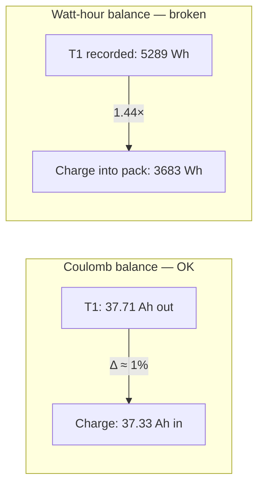
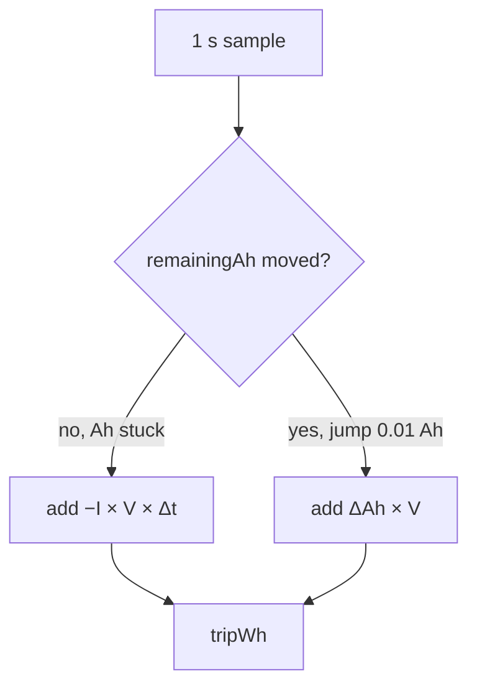
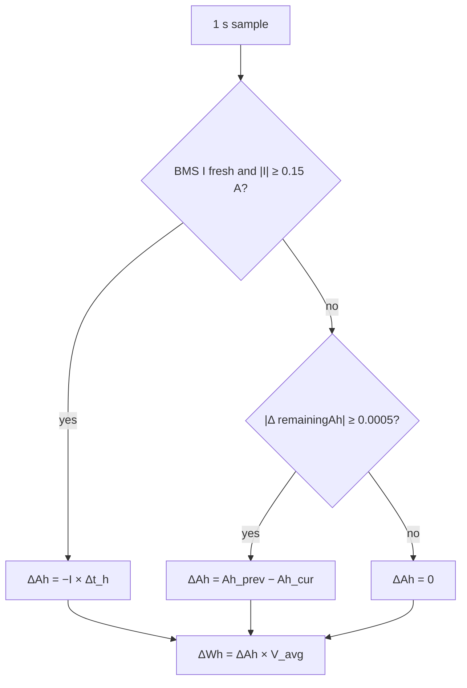
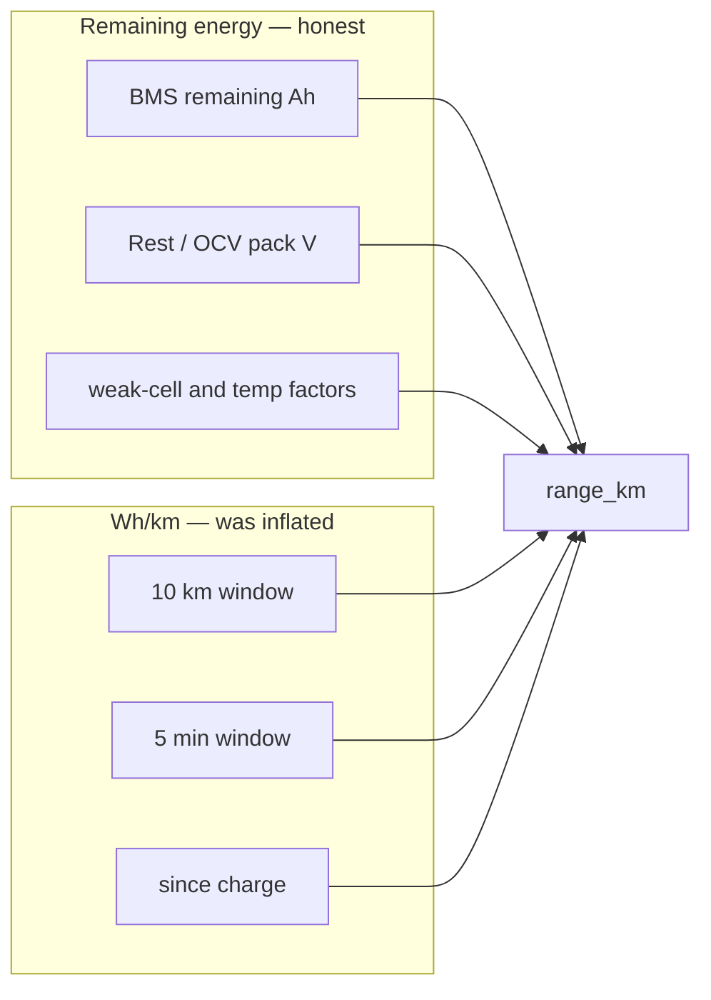

# Trip energy vs next charge (2026-08-22)

Forensic note: why recorded trip watt-hours were ~1.5× the next charge, whether remaining range was wrong by the same factor, and why controller current must not become the energy clock.

**Authoritative formulas** (after the fix): [`CalculationInfo.md`](CalculationInfo.md) §3–§6.  
**Source log:** S200X CSV `android/ev-telemetry-captures/2026-08-22_18-00-30/ev_telemetry/2026-08-22_04-52-53.csv` (41 308 rows, local UTC+3). Pack ~55 Ah, ~90–99 V, JBD BMS + FarDriver.

JBD sign: **positive current = charge into the pack**, negative = discharge.

---

## 1. The contradiction

A battery cannot deliver much more energy than the next charge puts back (a few percent of I²R / CV overhead is normal). On 22 Aug the plugin showed the opposite: trip Wh ≫ charge Wh, while **amp-hours matched**.

| Ratio | T1 | Meaning |
|---|---|---|
| Used Ah / charged Ah | 37.71 / 37.33 ≈ **1.01** | Pack coulomb clock is honest |
| ΔAh × Vmean / charge Wh | 3465 / 3683 ≈ **0.94** | Pack energy vs charger: ~6% overhead, physical |
| Recorded trip Wh / ΔAh × Vmean | 5289 / 3465 ≈ **1.53** | Software double-count |
| Recorded trip Wh / charge Wh | 5289 / 3683 ≈ **1.44** | Same bug vs the charger |

UI `used_ah` is start−end BMS remaining (correct). UI trip Wh is `RangeEstimator.tripWh` (was wrong).

---

## 2. Four legs

Charge bar is empty on T4: the session was still open at 17:01.

| Leg | BMS Ah start→end | Used Ah | Next charge Ah | Recorded Wh | ΔAh × Vmean | I·V only (no Ah ticks) | Charge Wh |
|---|---|---|---|---|---|---|---|
| T1 04:52–07:05 | 54.77 → 17.06 | 37.71 | 37.33 | **5289** | 3465 | 3473 | 3683 |
| T2 08:27–10:43 | 54.39 → 16.27 | 38.12 | 37.22 | **5409** | 3482 | 3562 | 3731 |
| T3 12:07–14:24 | 53.49 → 23.72 | 29.77 | 30.85 | **4348** | 2799 | 2845 | 2986 |
| T4 15:44–17:01 | 54.57 → 26.22 | 28.35 | — | **4035** | 2649 | 2681 | (open) |

```mermaid
xychart-beta
  title "Watt-hours by leg"
  x-axis ["T1", "T2", "T3", "T4"]
  y-axis "Wh" 0 --> 5600
  bar [5289, 5409, 4348, 4035]
  bar [3465, 3482, 2799, 2649]
  bar [3683, 3731, 2986, 0]
```

Series: recorded trip (inflated) · ΔAh × Vmean (pack) · next charge (T4 = 0).

Wheel distance and real specific use (not the inflated UI Wh/km):

| Leg | Wheel km | True Wh (ΔAh × Vmean) | True Wh/km | Recorded trip Wh / km |
|---|---|---|---|---|
| T1 | 53.9 | 3465 | **64.3** | 98.1 |
| T2 | 47.2 | 3482 | **73.8** | 114.7 |
| T3 | 47.3 | 2799 | **59.2** | 92.0 |
| T4 | 35.3 | 2649 | **75.1** | 114.4 |

History `specificWhKm` (~97 Wh/km on T1) used `RangeEstimator` distance (~54.3 km) and inflated Wh. Implied voltage from recorded 5289 / 37.71 Ah ≈ **140 V** vs a real pack of ~92 V.

---

## 3. Why Wh doubled and Ah did not

JBD remaining Ah often **holds for several seconds**, then jumps ~0.01 Ah.

### 3.1. Old integrator (bug)

Both branches are the **same coulombs**. While Ah is frozen, −I·V·Δt already accounts for them. When the counter finally ticks, ΔAh·V adds them again.

T1 split of seconds:

| Path | Seconds | Energy if used **alone** |
|---|---|---|
| I·V (Ah stuck) | 5429 | ≈ 3473 Wh |
| ΔAh tick | 2204 | ≈ 3470 Wh |
| **Sum (what UI stored)** | | **5289 Wh** |

`coulombAh()` used ΔAh when the counter moved, else −I·Δt. `segmentEnergyWh()` then **overwrote** that with −I·V·Δt whenever ΔAh ≈ 0 — and still added ΔAh·V on the tick. Two clocks on one interval.

### 3.2. Charge energy (was already honest)

While a charge session is open and \(I \ge 0.15\) A:

\[
Wh_{\text{charge}} += V \times I \times \Delta t_{\text{h}}
\]

One clock only. That is why charge Wh sat next to ΔAh × Vmean (~6% above discharge), and trip Wh did not.

### 3.3. Fix (current builds)

One clock, never both:

\[
\Delta Ah =
\begin{cases}
-I_{\text{BMS}} \times \Delta t_{\text{h}} & \text{if } |I| \ge 0.15\,\text{A} \\
Ah_{\text{prev}} - Ah_{\text{cur}} & \text{otherwise, if } |\Delta Ah_{\text{BMS}}| \ge 0.0005\,\text{Ah} \\
0 & \text{otherwise}
\end{cases}
\]

\[
\Delta Wh = \Delta Ah \times \frac{V_{\text{prev}}+V_{\text{cur}}}{2}
\]

`I` is passed into `RangeEstimator` **only** when the BMS snapshot is fresh. Historical CSV/GPX from 22 Aug still contain inflated `consumption_wh_km` (trip Wh).

Drop the segment if ΔAh < −0.25 Ah in one second (charge discontinuity / BMS jump).

---

## 4. Should controller current be the trip-energy clock?

**No.** “Energy spent on the charge-trip” is energy **that left the pack**. It has to close against the next charge. That clock is BMS I and V.

FarDriver `lineCurrentA` is inverter input, not pack current.

| Check (22 Aug, discharge \|I_bms\| ≥ 5 A) | Result |
|---|---|
| Sign vs JBD | **Opposite** (controller + = discharge; JBD + = charge) |
| Median \|I_ctrl\| / \|I_bms\| | **1.03** |
| Seconds with \|ratio − 1\| > 0.3 | **42%** |
| Day integral | BMS **12 889 Wh**, controller **12 407 Wh** (−4%) |
| During charge | Controller ≈ 0 (does not see the charger) |

Scatter (p10…p90 of I_ctrl / \|I_bms\| ≈ 0.56…1.90) is too wide for a coulomb meter. The −4% vs BMS is accessories / DC-DC / shunt, not “truer motor work”.

If controller I were plugged into the old integrator **without a sign flip**, trip Wh would go negative. If it replaced BMS I, the 1.53× bug would still be there: that bug is two software clocks, not a bad shunt.

FarDriver lifetime Wh/km is a byte × 4 — too coarse for remaining range. The plugin already uses it only as a last fallback when the 10 km / 5 min / DOC windows are empty.

Use controller current as a **widget** (motor power) and as a **fallback display** when BMS is stale. Do not use it for trip Wh, DOC Wh/km, or remaining range.

---

## 5. Was remaining range low by the same ~1.5×?

**No.** Remaining range is not “inflated trip Wh”. It is:

\[
R = \frac{Ah_{\text{rem}} \times V_{\text{rest}} \times f_{\text{cell}} \times f_{T}}{w}
\]

| Term | Inflated on 22 Aug? |
|---|---|
| \(Ah_{\text{rem}}\) | No (BMS remaining) |
| \(V_{\text{rest}}\) | No — last rest pack V, **higher** than loaded V → numerator a bit **optimistic** |
| \(w\) | Yes — 10 km (else 5 min / DOC) Wh/km from the same integrator |

So only the **denominator** carried the bug, and rest voltage in the numerator **partially offset** it. Smoothing (70/30, max step 15% or 3 km) hid second-to-second jumps of `coverage_wh_km` (50–142 Wh/km on T1).

Primary range uses the last **10 km**, not the whole-trip 5289 Wh. After a charge the window is frozen (`refreshRemaining()`), so the first kilometres of the next leg still see the previous Wh/km, not an instant 1.53×.

### 5.1. Shown range vs Ah-so-far remaining km

“True remaining” below = \(Ah_{\text{now}} / (Ah_{\text{used}} / km_{\text{so far}})\), wheel odo, after ≥ 8 km. That is “if we keep burning Ah like this leg so far”.

| Leg | Typical shown / true | What happened |
|---|---|---|
| T1, T3 | **0.70–0.83** | 17–30% low, **not** 53% |
| T2, T4 | **1.05–1.4** | Hard start, then easier; 10 km window lags |

Mid-leg snapshots:

| Leg | Fraction | Wheel km | Ah | Shown km | Ah-so-far remaining km | shown/true | `coverage_wh_km` |
|---|---|---|---|---|---|---|---|
| T1 | 0.25 | 13.5 | 47.22 | 65.8 | 84.3 | 0.78 | 70.7 |
| T1 | 0.55 | 29.7 | 37.52 | 45.6 | 64.5 | 0.71 | 50.8 |
| T1 | 0.85 | 45.8 | 25.37 | 25.3 | 39.6 | 0.64 | 142.4 |
| T2 | 0.25 | 11.8 | 38.60 | 39.5 | 28.8 | 1.37 | 102.8 |
| T2 | 0.85 | 40.1 | 21.00 | 26.4 | 25.2 | 1.05 | 102.9 |
| T3 | 0.25 | 11.8 | 46.27 | 58.5 | 75.7 | 0.77 | 87.7 |
| T3 | 0.85 | 40.2 | 28.26 | 31.1 | 45.0 | 0.69 | 90.0 |
| T4 | 0.40 | 14.1 | 38.78 | 51.6 | 34.6 | 1.49 | 77.1 |
| T4 | 0.85 | 30.0 | 29.05 | 40.6 | 34.1 | 1.19 | 57.4 |

### 5.2. Why the widget felt “about right”

Rides stopped at a charger with **16–26 Ah still in the pack**, not at empty.

T1: start range **60 km**, wheel distance **54 km**, arrived with **17 Ah** and ~14 km still shown. “Will I make this stop?” was a small positive reserve. “How far to 0%?” would have been larger than the widget at the end (coverage spiked to ~140 Wh/km).

Trip total Wh can lie by 1.5× while range still looks usable, because they do not share a numerator.

---

## 6. GPS walking must not add kilometres

Related odometer bug shipped with the same energy fix.

Distance for remaining range prefers wheel → GPS → controller → v×t. While charging, walking with a phone made GPS haversine spin `charge_trip_km` and the 10 km window. After charge, GPS-only motion without EV evidence did the same.

**EV motion evidence** (any one):

- controller speed or RPM above idle, or
- CSC wheel speed above idle, or
- BMS discharge \(I \le -2\) A

8 s BLE grace after the last evidence. `isVehicleMoving()` uses this, **not** GPS speed. `chooseDistanceKm(..., allowGps)` is false without evidence, so walking does not add km on charge or on a charge-trip.

Controller/wheel odometers still count real rotation.

---

## 7. What to trust on old logs

| Quantity | 22 Aug CSV | After single-clock build |
|---|---|---|
| `remaining_ah` / `used_ah` | Trust | Trust |
| Charge Wh / charged Ah | Trust | Trust |
| `consumption_wh_km` (trip Wh) | ×1.5, discard | Should match ΔAh × Vmean |
| `coverage_wh_km` | Noisy, high | Pack Wh / km |
| `range_km` | Roughly usable, 10–30% error typical | Follows real Wh/km |
| Controller `power_w` | Motor-side, noisy | Same; not pack energy |

Recompute pack trip energy from a historical CSV as:

\[
Wh_{\text{true}} \approx \bigl(Ah_{\text{start}} - Ah_{\text{end}}\bigr) \times V_{\text{mean}}
\]

or as \(\sum -I_{\text{BMS}} \times V \times \Delta t\) **without** adding ΔAh ticks.

---

## 8. Code map

| Piece | File |
|---|---|
| Single-clock ΔAh / ΔWh, 10 km window, range | `RangeEstimator.kt` (`coulombAh`, `segmentEnergyWh`, `recalculate`) |
| BMS current only if fresh; GPS gated on EV motion | `EvBmsPlugin.kt` (`publishSample`, `hasEvMotionEvidence`) |
| Charge V·I·Δt | `EvBmsPlugin.kt` (`chargeEnergyWhAcc`) |
| Rest V, weak-cell Ah | `EvBmsPlugin.kt` (`energyVoltageV`, `effectiveRemainingAh`), `SocCalibrator.kt` |
| FarDriver line current (display only) | `FarDriverProtocol.kt` `lineCurrentA` |
