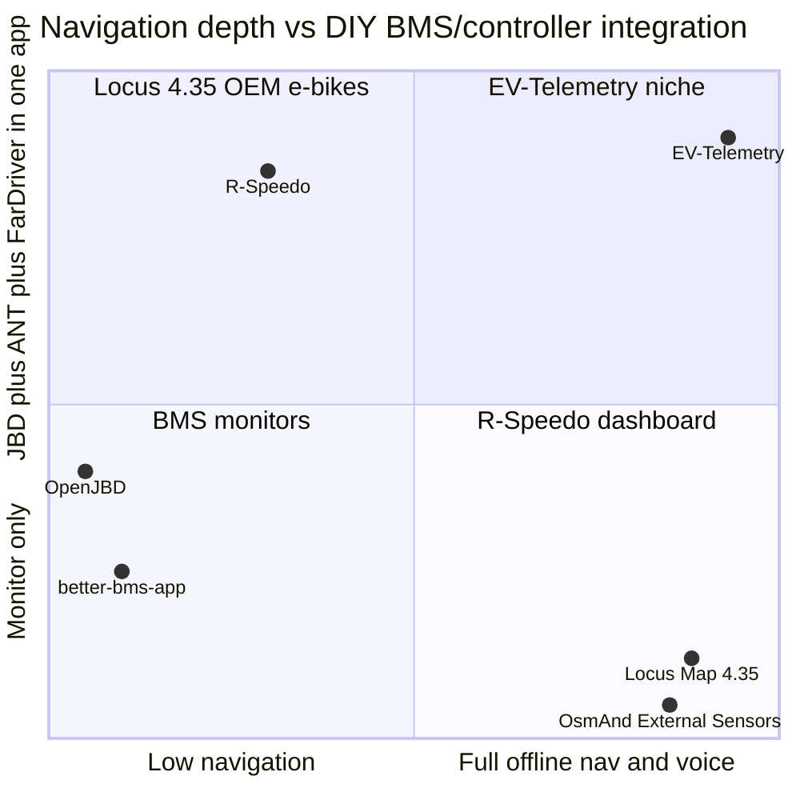

# EV-Telemetry vs analog projects

Comparison of the **EV-Telemetry** plugin in this OsmAnd fork with the closest open-source and commercial alternatives.

Last updated: 2026-08-21.  
Plugin code: `../` (parent of this `doc/` folder).  
Field reference: [`EV-Telemetry.md`](EV-Telemetry.md). Range and energy methodology: [`CalculationInfo.md`](CalculationInfo.md). BMS wire protocol: [`BMS_DATA_ABOUT.md`](BMS_DATA_ABOUT.md).

---

## 1. Executive summary

| | EV-Telemetry (this fork) | [R-Speedo](https://github.com/rasyid-irsyadi/r-speedo.app) | [Locus Map 4.35+](https://www.locusmap.app/) |
|---|---|---|---|
| **Role** | Navigation app + EV telemetry plugin | Standalone EV dashboard (PWA + Android APK) | Navigation app + e-bike sensor integration |
| **DIY target** | JBD, ANT, FarDriver, VESC, CSC wheel/cadence | JBD, ANT, JK, Daly, FarDriver, Votol, VESC, … | Factory e-bikes (Bosch, Shimano, Fazua, Specialized, …) |
| **Unique strength** | Offline turn-by-turn **voice** navigation fused with live BMS range, route reserve, charge markers on GPX | Richest **trip/charge reports** and multi-battery UI in one EV dashboard | Mature navigation + **remaining range** from OEM BLE protocols + community sensor adapters |
| **Gap vs others** | No multi-pack UI; niche DIY protocols; large in-tree diff for upstream | No full voice navigation; premium APK; not a map engine | No JBD / ANT / FarDriver for DIY builds |

No public OsmAnd fork was found that combines **JBD + ANT + FarDriver** in one navigation plugin. This project appears unique in that combination.

---

## 2. Feature-by-feature: EV-Telemetry vs R-Speedo vs Locus 4.35

Legend: **Yes** / **Partial** / **No** / **N/A** (not applicable to that product class).

### 2.1. Navigation and voice

| Feature | EV-Telemetry | R-Speedo | Locus 4.35 |
|---|---|---|---|
| Offline OSM maps | Yes (OsmAnd) | Partial (route/map panels, not full OsmAnd engine) | Yes |
| Turn-by-turn routing | Yes | Partial (route search, ETA context) | Yes |
| Voice navigation prompts | Yes (OsmAnd TTS) | No | Yes (audio coach) |
| Voice **range / reserve** announcements during ride | Yes (`EvVoiceAnnouncer`: range on stop, range vs route, reserve thresholds) | No dedicated nav voice for range | Partial (dashboard/audio variables for OEM **remaining range** only) |
| Range vs **active route** (reserve km) | Yes | Not equivalent to OsmAnd route engine | Partial (OEM range on dashboard, not DIY BMS fusion) |
| Hike / low-BLE-power mode | Yes (poll ≥ 5 s) | Unknown / not documented | N/A |

### 2.2. Hardware and BLE protocols

| Feature | EV-Telemetry | R-Speedo | Locus 4.35 |
|---|---|---|---|
| JBD / Xiaoxiang BMS (BLE) | Yes (auth, cells, poll) | Yes (read-only, since 2026-08) | No |
| ANT BMS (BLE) | Yes | Yes | No |
| FarDriver controller (BLE/UART) | Yes | Yes | No |
| VESC (BLE) | Yes | Yes (read-only) | No |
| Votol controller | No | Yes | No |
| JK / Daly BMS | No | Yes | No |
| CSC wheel speed (BK6LS) | Yes (dedicated role) | No (TPMS BLE optional) | Partial (generic speed/cadence sensors, not BMS stack) |
| CSC cadence (BK6LC, separate device) | Yes | No | Partial (cadence sensor profile) |
| Multi-battery / multi-pack | No (single pack workflow) | Yes | N/A |
| TPMS | No | Yes (BLE ads) | Partial (via adapters / sensors) |
| Factory e-bike (Bosch, Shimano, …) | No | No | Yes |

### 2.3. Battery telemetry and range logic

| Feature | EV-Telemetry | R-Speedo | Locus 4.35 |
|---|---|---|---|
| Live SOC, V, I, cells, temperature | Yes | Yes | Partial (OEM fields only) |
| SOC from OCV + weak-cell correction | Yes (`SocCalibrator`) | Unknown | N/A |
| Remaining range — rolling **10 km** window | Yes | Yes (report / dashboard logic) | N/A |
| Remaining range — **5 min** window | Yes | Partial | N/A |
| Remaining range — since **charge** (DOC/PNZ) | Yes | Yes (charge session context) | N/A |
| Energy model (Wh, weak cell, temperature derating) | Yes (documented in `EV-Telemetry.md` §4) | Partial | N/A |
| Route **elevation profile** in consumption | Yes | Unknown | N/A |
| Distance priority: wheel → GPS → controller → v×t | Yes | Partial (GPS + telemetry) | OEM-dependent |
| Controller average Wh/km (FarDriver) | Yes | Partial | N/A |
| BMS current for energy (not controller I) | Yes (by design) | Unknown | N/A |

### 2.4. Recording, journal, statistics

| Feature | EV-Telemetry | R-Speedo | Locus 4.35 |
|---|---|---|---|
| Trip telemetry CSV | Yes (field-selectable) | Yes | Partial (track + sensor columns) |
| GPX with custom telemetry extensions | Yes | Yes | Yes (sensor data on track) |
| **Charging points** on trip GPX | Yes (Wh charged annotation) | Yes (charge session in reports) | No (DIY BMS) |
| Automatic charge session detection | Yes (still + current + re-arm rules) | Yes | N/A |
| Trip / charge **history** UI | Yes (`EvHistoryStore`, charts) | Yes (reports, exports) | Yes (track list) |
| Live charts during ride | Yes (~4 min window) | Yes (multiple layouts) | Yes (4.35 interactive charts) |
| Tap chart to inspect value | Yes | Unknown | Yes (4.35) |
| Session odometer reset policy | Yes (new recording only; doc §5) | Unknown | OEM trip fields |
| Export PNG / JSON report bundle | No | Yes | Partial (GPX/KML) |
| Dragger / dyno modes | No | Yes (Layouts 8–9) | No |

### 2.5. UX, licensing, distribution

| Feature | EV-Telemetry | R-Speedo | Locus 4.35 |
|---|---|---|---|
| Open-source core | Yes (GPL, this fork) | Docs + knowledge base OSS; app partly premium | App closed; [locus-api](https://github.com/asamm/locus-api) OSS for adapters |
| Single app (nav + telemetry) | Yes | Yes (dashboard-first) | Yes |
| Plugin optional / disable | Yes (OsmAnd plugin) | N/A | Sensors optional |
| Documented protocol reverse-engineering | Yes (`BMS_DATA_ABOUT.md`) | Yes (ev-telemetry-guide) | OEM + adapter docs |
| Maintainer | Personal fork (`livello`) | Rasyid Irsyadi | Asamm |

---

## 3. Wider landscape (other analogs)

These projects overlap **one layer** (BMS monitor, dashboard, or nav) but not the full EV-Telemetry stack.

| Project | Stack | Navigation + voice | Live DIY range | Trip / charge journal | Notes |
|---|---|---|---|---|---|
| **[OpenJBD](https://github.com/gytxtx/OpenJBD)** | JBD BLE | No | Partial (time-to-empty by current) | No | Clean JBD dashboard; explicitly **no** history export |
| **[better-bms-app](https://github.com/encap/better-bms-app)** | JK BMS PWA | No | Yes (Wh/km + GPS speed) | Partial (charts, no charge GPX) | Author motivated by crashes when switching to Maps |
| **[BatteryHub](https://github.com/driller442/BatteryHub)** | JBD/ANT/Daly Python | No | No | CSV log | Desktop / Pi monitor |
| **[batmon-ha](https://github.com/fl4p/batmon-ha)** | JBD/ANT/JK/Daly | No | No | HA history | Smart-home, not riding |
| **[EBikeLocus](https://github.com/hoschilo/EBikeLocus)** / **[locus-brose-adapter](https://github.com/hoschilo/locus-brose-adapter)** | Brose → Locus | Yes (via Locus) | Yes (OEM range field) | Locus tracks | Template for **adapter** pattern, not DIY BMS |
| **[eBikeMonitor](https://github.com/thtexpert/eBikeMonitor)** | Bosch → MQTT | No | Partial | MQTT log | Smart home bridge |
| **[BYDMate](https://github.com/AndyShaman/BYDMate)** | BYD car BMS | No | Yes (widget) | Yes (trips + charges) | Close **product idea** for cars, not e-bike DIY |
| **FarDriver ESP32 dashboards** ([EKSR](https://github.com/magicmicros/EKSR_Instrument), etc.) | FarDriver BLE | No | No | Trip on display | Hardware display, not phone nav |
| **OsmAnd External Sensors** (upstream) | BLE HR, cadence, speed | Yes | No | GPX sensor columns | **Not** BMS/controller protocols |

---

## 4. Positioning diagram



---

## 5. Upstream OsmAnd: what a successful pull request needs

OsmAnd plugins are **in-tree** (`net.osmand.plus.plugins.*`), registered in `PluginsHelper` — not separate Play Store plugins ([issue #2173](https://github.com/osmandapp/OsmAnd/issues/2173)). Maintainers expect **discussion before a large merge**; code must be maintainable by the core team.

### 5.1. Before opening the PR

1. **Open a GitHub issue** (or thread on [OsmAnd Google group](https://groups.google.com/g/osmand)) describing:
   - user problem (DIY EV navigation + range, not generic OBD),
   - scope (new plugin vs extending External Sensors),
   - maintenance commitment.
2. **Expect negotiation** — full merge of ~4k lines + BLE reverse-engineering may be split into phases or declined; a maintained fork remains valid.
3. **Rebase onto latest `master`** and keep the branch focused on plugin + required hooks only.

### 5.2. What to include in the PR

| Area | Requirement |
|---|---|
| **Code** | `EvBmsPlugin` + `plugins/evbms/**`; minimal edits outside (`PluginsHelper`, settings registration, strings, icons, manifest permissions if needed) |
| **Strings** | English in `values/strings.xml`; other locales via Weblate workflow where possible — avoid huge one-off `values-ru` only dumps unless team agrees |
| **Permissions** | Justify `BLUETOOTH_*`, location (BLE scan), background use; follow Android 12+ patterns already used in External Sensors |
| **Privacy** | No phone-home; document local storage (history, CSV, GPX paths) |
| **License** | GPL-2.0 / project headers consistent with OsmAnd |
| **Tests** | Unit tests for parsers (`JbdBmsProtocol`, `RangeEstimator` math) — upstream rarely has UI tests for plugins |
| **Docs** | Short user-facing help (OsmAnd docs repo or in-plugin “About”); protocol docs for maintainers |

### 5.3. What to **exclude** from the PR

- Fork-only **`README.md`** section, `net.osmand.dev` packaging, Nightly/OpenGL build hacks
- Personal **`tools/build-*.sh`**, **`tools/install-*.sh`**, `gradle.properties` local overrides
- **`EvBmsRevision.GIT_HASH`** stamp used for personal builds — replace with version from `VersionInfo` or drop
- Unrelated merges (docs translation, upstream sync commits) — squash or split

### 5.4. Documentation layout

Documentation lives next to the plugin:

```
OsmAnd/src/net/osmand/plus/plugins/evbms/
  README.md
  doc/
    EV-Telemetry.md
    CalculationInfo.md
    BMS_DATA_ABOUT.md
    README-ANALOG.md
```

**Not required by upstream formally** — there is no published “plugin must have README in folder” rule — but it **helps reviewers** and is the right structure for a merge.

### 5.5. Branch and commits

| Approach | Verdict |
|---|---|
| **Separate branch** off current `osmandapp/Osmand` `master` | **Yes, required** — e.g. `feature/ev-telemetry-plugin` |
| **Single squashed commit** | **Helpful for first review** of a large feature; not mandatory if history is already clean |
| **One commit vs many** | Squash **fork-specific** noise; keep **logical splits** if upstream asks (e.g. commit 1: plugin skeleton + registration, commit 2: JBD/ANT, commit 3: FarDriver/VESC, commit 4: range + voice) |

Practical workflow:

```bash
git fetch upstream
git checkout -b feature/ev-telemetry-plugin upstream/master
# cherry-pick or soft-reset squash from feature/ev-bms-fardriver-plugin
# drop fork-only files
git push origin feature/ev-telemetry-plugin
gh pr create --repo osmandapp/Osmand --base master ...
```

### 5.6. Likely review questions

- Why not extend **External Sensors** instead of a new plugin?
- Who maintains JBD/ANT protocol changes when vendors change BLE?
- Battery safety disclaimers (read-only BMS vs write commands — you are read-only, state that clearly).
- Plugin default: **disabled** until user enables (match other plugins).
- Pro vs free feature split if upstream cares about OsmAnd Pro boundaries.

### 5.7. Realistic outcomes

1. **Full merge** — unlikely in one shot given size and niche hardware.
2. **Partial merge** — e.g. External Sensors hooks + BLE CSC + GPX fields; range/voice later.
3. **No merge, documented fork** — keep releases on `livello/OsmAnd`; contribute small fixes upstream separately.

---

## 6. References

- R-Speedo: https://github.com/rasyid-irsyadi/r-speedo.app (compatibility table 2026-08-15)
- Locus Map 4.35 e-bike announcement: https://www.locusmap.app/interactive-charts-ability-to-connect-e-bikes/
- Locus sensor adapter API: https://github.com/asamm/locus-api
- OsmAnd plugin architecture: `AGENTS.md` in [osmandapp/OsmAnd](https://github.com/osmandapp/OsmAnd)
- OsmAnd plugin development discussion: https://github.com/osmandapp/OsmAnd/issues/2173
